<p align="center">
  
</p>

<h1 align="center">CAMusic</h1>

<p align="center"><strong>Your library, your speakers, your lights, in one local app.</strong></p>

<p align="center">
  A music player for the servers you already run, with a Philips Hue light show,<br>
  ambience effects and multi-room audio built in. Everything happens on your own network.
</p>

<p align="center">
  <a href="https://github.com/engabd11/CAMusic/releases"></a>
  <a href="LICENSE"></a>
  
  
</p>

---

## Overview

CAMusic plays the music you own, from whichever server you run, and turns the room around
it into part of the listening.

| | |
|---|---|
|  **A player** | Navidrome, Subsonic-compatible (Gonic, Airsonic, Ampache, Funkwhale, epoupon's LMS), Jellyfin, Emby, Plex, MPD (moOde, Volumio, piCorePlayer and Mopidy are all MPD underneath), Music Assistant and on-device files — plus Spotify, Qobuz and Tidal accounts and foobar2000 over its Beefweb plugin (experimental). Gapless playback, a ten band equaliser, high resolution output, ReplayGain and offline downloads. |
|  **A light show** | Philips Hue Entertainment, driven straight to the bridge at 60 frames a second from the audio that is playing. |
|  **An atmosphere** | Ambience shows with their own sound, ready whenever you want the room without the music. |
|  **A speaker** | Music Assistant can stream to this phone as a clock synced player, so it joins a grouped, multi-room setup. And what the phone plays itself can go out over **AirPlay** to an Apple TV or HomePod, from the top-left of Now Playing. |

Runs on phones and tablets, Android TV, Android Auto and LG webOS televisions.

<p align="center">
  
  
  
</p>
<p align="center">
  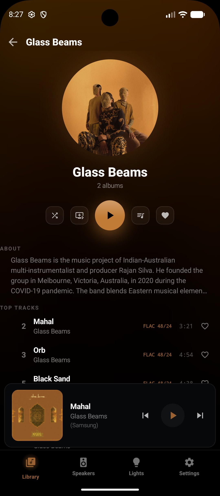
  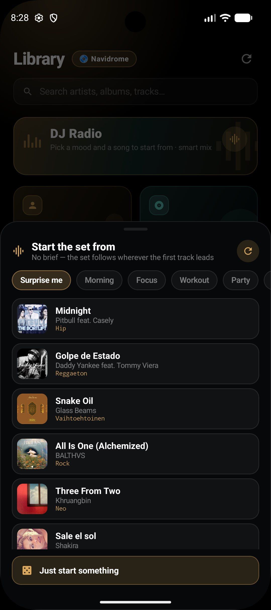
  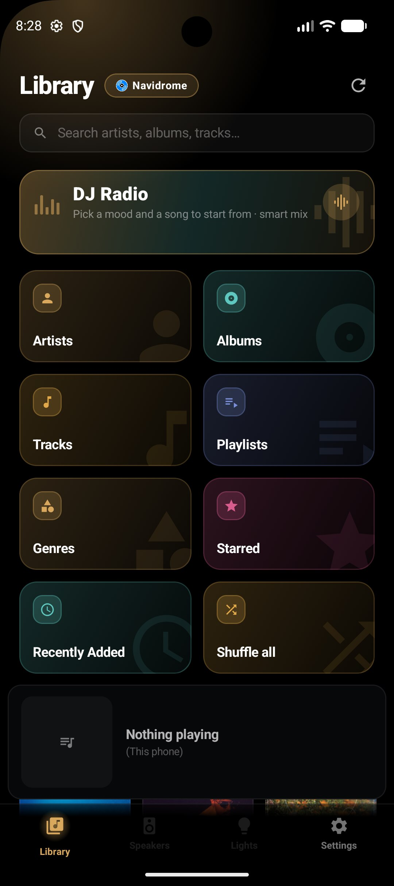
  
  
</p>
<p align="center">
  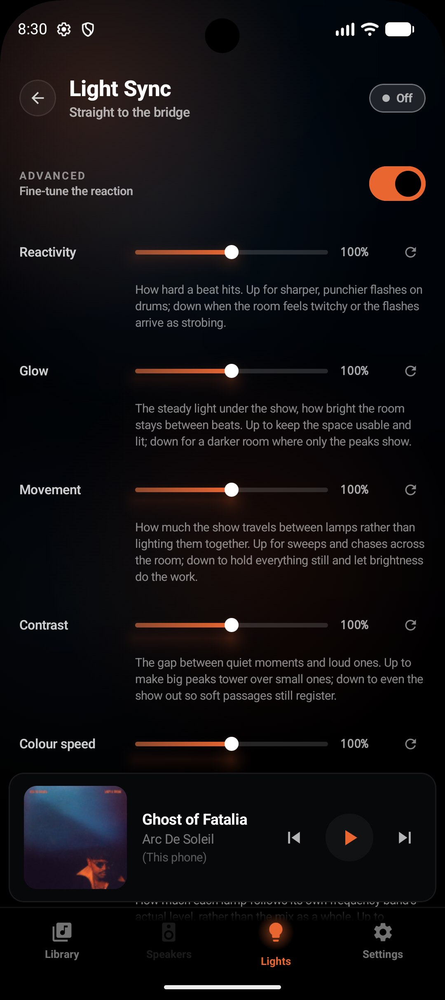
  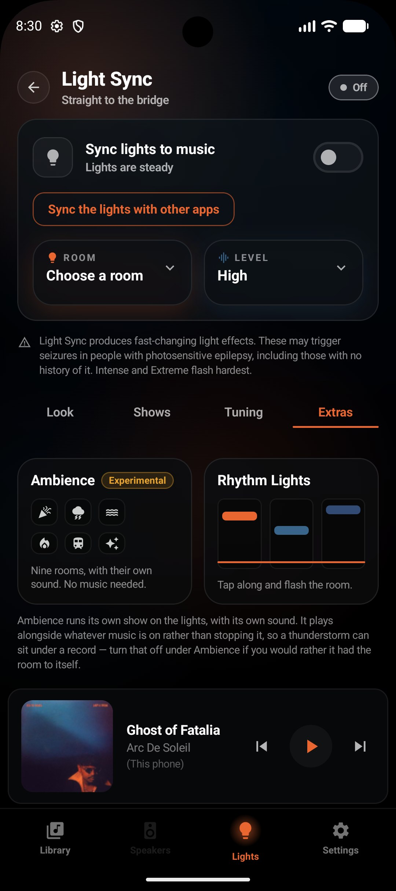
  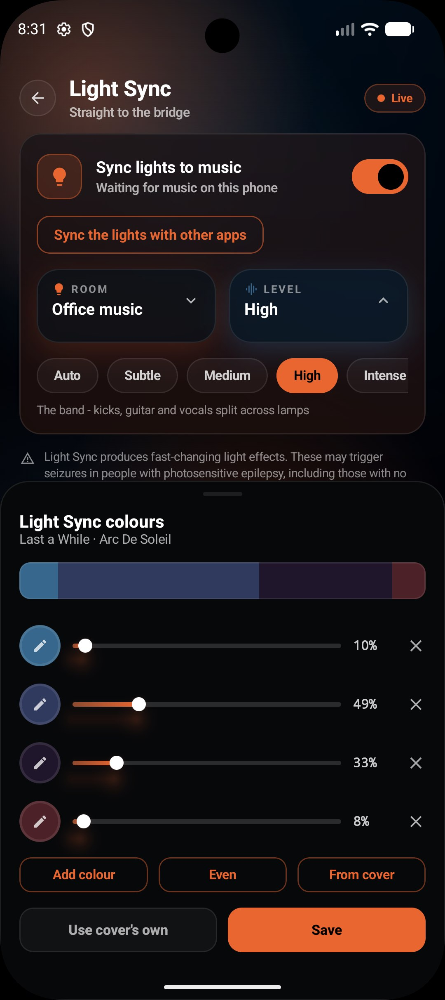
  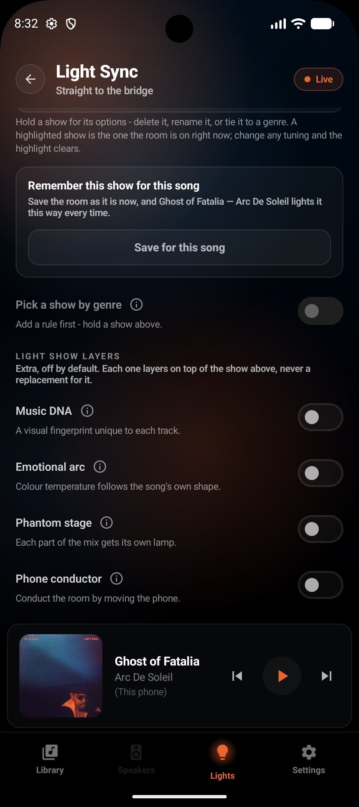
</p>
<p align="center">
  <em>Android Auto</em>&nbsp;&nbsp;&nbsp;&nbsp;&nbsp;<em><br>
  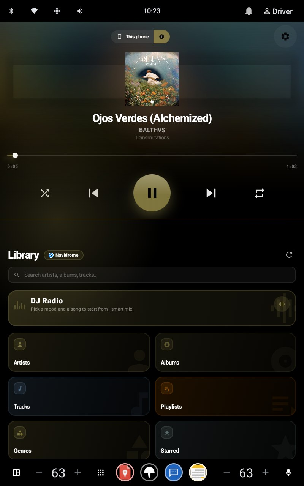
  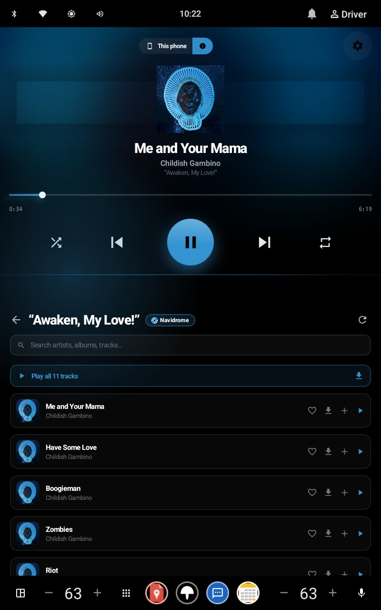
  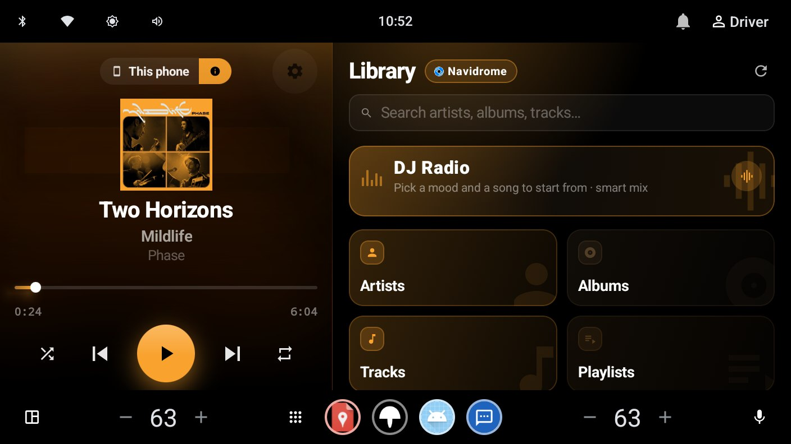
</p>
<p align="center">
  <em>Android TV</em>&nbsp;&nbsp;&nbsp;&nbsp;&nbsp;<em>Tablet</em><br>
  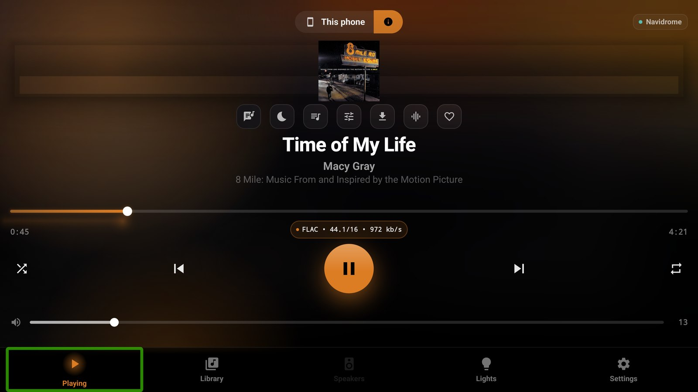
  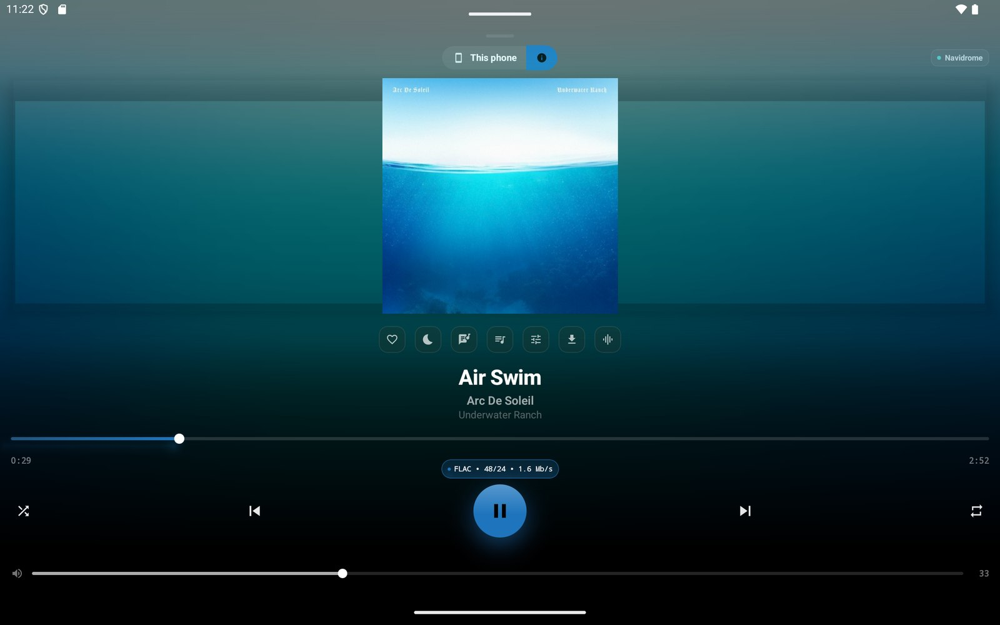
</p>

---

## Why CAMusic

CAMusic is short for Cyborg Automation Music, built by
[Cyborg Automation AU](https://github.com/engabd11).

The idea started with Philips Hue. Spotify and Samsung's Music Sync can drive the Hue
Entertainment system properly, and if you listen anywhere else most players fall back to a
generic colour cycle that leaves the rest of what the bridge can do on the table. CAMusic
renders straight to the bridge at 60 frames a second instead, reading the room's own layout
and the track itself to shape every effect, so a Hue Entertainment setup gets the quality it
is actually capable of whatever you are playing from.

The player grew from there into the whole point: one app that browses every library you own,
sounds right on good hardware, and lights the room while it plays.

---

## Your libraries

Point CAMusic at a server you already run. Every backend is a first class citizen, and you
can add as many as you like and switch between them freely.

| Server | Browse | Play | Download | Scrobble |
|---|:---:|:---:|:---:|:---:|
| **Navidrome** | ✅ | ✅ | ✅ | ✅ |
| **Subsonic-compatible** — Gonic, Airsonic, Ampache, Funkwhale, LMS | ✅ | ✅ | ✅ | ✅ |
| **Jellyfin** | ✅ | ✅ | ✅ | ✅ |
| **Emby** | ✅ | ✅ | ✅ | ✅ |
| **Plex** | ✅ | ✅ | ✅ | ✅ |
| **MPD** | ✅ | ✅ | — | — |
| **Music Assistant** | ✅ | ✅ | n/a | ✅ |
| **On-device files** | ✅ | ✅ | n/a | n/a |
| **Spotify · Qobuz · Tidal** | 🔬 | 🔬 | — | — |
| **foobar2000** (via Beefweb) | 🔬 | 🔬 | — | — |

🔬 **Experimental** — the three streaming *accounts* are played on this phone with light
sync and no Music Assistant required (see [Streaming services](#streaming-services-experimental));
foobar2000 works like MPD — the desktop player keeps the sound and the phone drives it over
the [Beefweb](https://github.com/hyperblast/beefweb) plugin's REST API — and is marked
experimental only because it has not yet been run against a real install. All of them are
offered in first-run setup and in Settings → Libraries, under their own heading.

Artists, albums, playlists, radio, podcasts and audiobooks, with search across all of them.
Multi-disc albums group properly, liner notes and biographies appear where the server has
them, and each server shows its own brand mark everywhere it is listed. The picker groups
servers into families — Subsonic servers, media servers, MPD — so a moOde or Funkwhale owner
finds theirs without knowing which API it speaks, and **every server's settings page is dressed
in that server's own colours**: Jellyfin's purple-to-cyan, Emby's green, Plex's gold, Music
Assistant's blue, and the streaming services in their full brand palettes.

Plex signs in through a plex.tv PIN: tap **Sign in with Plex**, finish it in the browser, and
your Plex password stays at plex.tv where it belongs.

**Subsonic-compatible** is Navidrome's API by another name, so anything speaking it works the
same way — Gonic, Airsonic, Ampache, Funkwhale, epoupon's LMS. Each server answers with what
it has: lyrics, ReplayGain and exact formats ride the OpenSubsonic extensions, so an older
server just loses those extras rather than showing empty panes. Two need one thing the others
don't: Ampache needs an admin to switch its Subsonic backend on (Admin → Server Config) and
wants the Subsonic password from your account page rather than the web login, and Funkwhale
won't take your account password either — Settings → Subsonic API → Request a password
generates the one CAMusic wants.

MPD is the one library that plays its own music, and moOde, Volumio, piCorePlayer and Mopidy are
all MPD underneath, so the one row is their app as much as MPD's. Every other server hands out a URL
per track and the phone decodes it; MPD is already a player, usually on the box the DAC is plugged
into, so the sound stays there and the phone becomes the remote — play, pause, seek, skip, the queue,
shuffle and repeat, all of it addressing MPD. Point it at the protocol port (6600) and that is
the whole setup: no `httpd` output, no stream, nothing to configure twice. ReplayGain is MPD's
own, set from the loudness control in the Now Playing options sheet. Covers come down the
protocol socket, embedded art first and a folder cover behind it. There is no download column
because MPD has no endpoint that hands a file over. The Now Playing overlays and quality badge
show MPD's own live output — codec, sample rate, depth, channels and the bitrate it is decoding
right now — rather than this phone's, and Light Sync runs from an offline scan the same way it
does for any other server driving a speaker in another room.

**Continue listening** leads the library with the albums and songs you were last in the
middle of, including Jellyfin's own resume shelf. Anything can be taken offline for the train,
with a storage cap and a Wi-Fi only option, and downloads browse as a library of their own.

---

## Streaming services (experimental)

You do not run a server to listen to Spotify, Qobuz or Tidal — so CAMusic treats them as
**accounts, not servers**: a sign-in instead of an address, the music played on this phone
by the same engine the self-hosted libraries use, and Light Sync riding on it as normal.
No Music Assistant required, and nothing about your account leaves the phone.

All three are **experimental**, and the tag is doing real work: no streaming service
publishes an API a player like this one may use, so each of these rides an unofficial
client or the service's own undocumented endpoints, and a provider's next change can
break one. They are offered under their own heading — in first-run setup and in
Settings → Libraries — rather than mixed in with the servers.

**Qobuz and Tidal also want the *app's* own registration**, separate from your account.
A build carries whatever pair it was given at build time (gradle properties, see
[docs/plan/direct-streaming-providers.md](docs/plan/direct-streaming-providers.md));
when it carries none — a fork, or an APK built from a plain checkout — the connect form
asks for one, so you can use credentials of your own. Spotify needs no such pair:
librespot signs in as your own client.

Each account has a settings page of its own, in the service's colours, with the settings
its client actually exposes rather than a generic stream-quality toggle: Spotify's audio
quality, normalisation, autoplay, crossfade, preload and Spotify Connect device name;
Qobuz's format tiers (MP3, CD, Hi-Res, Hi-Res+); Tidal's tiers (Low, High, HiFi, Max). Each
page also shows who is signed in and what the plan streams up to, and warns when the chosen
tier is above it.

The engineering detail lives in
[docs/plan/direct-streaming-providers.md](docs/plan/direct-streaming-providers.md).

### Spotify 🔬

Plays through an **embedded librespot client** — the same open-source Spotify client Music
Assistant uses — so the audio is decoded inside CAMusic itself. That makes it the only
streaming service here whose output feeds Light Sync's analysis tap directly, with no
capture prompt and no second app involved. Browsing covers your saved tracks and albums,
playlists, artist pages and search; a Premium account is required (free accounts cannot
stream), and sign-in uses your Spotify credentials without any Spotify developer app
involved. Queue editing mid-playback and instant seek are on the roadmap.

### Qobuz 🔬

Browses the API Qobuz's own web player uses and streams **FLAC up to 24 bit / 192 kHz** —
the only one of the three with lossless at the top tier. Your favourites *are* your library
(artists, albums, tracks), alongside your playlists and full search. Requires a Qobuz
subscription and, for the moment, app credentials entered alongside your login (see the
plan doc).

### Tidal 🔬

Signs in the way Tidal's own TV clients do: the app shows you a code, you approve it at
link.tidal.com in a browser, and no password is ever typed here. Browses your favourites
and playlists with full search, and plays through Tidal's own playback manifests — from
AAC 320 up to lossless FLAC, depending on what your subscription serves for the track.

### What to expect while experimental

Nothing here is guaranteed: these services offer no official third-party APIs, so each
integration talks to endpoints that can change without notice, exactly the way Music
Assistant's integrations do. If a provider breaks, it breaks *openly* — the status screen
says what it cannot hear, and the fix usually lands in a day or two upstream. YouTube Music
is deliberately not on the roadmap: Google withdrew the sign-in path third-party clients
relied on, and its apps refuse the audio capture the other routes would need.

---

## Sound

Playback is built to be worth good headphones and a good DAC.

- **A ten band equaliser** for everything this phone plays, built on RBJ biquads in a
  zero latency cascade, with automatic headroom so a boosted band stays clean on loud
  masters. Music Assistant's own parametric DSP is exposed separately for the rooms it runs.
- **The real signal path**, reported a stage at a time: what the file declares, what the
  decoder handed over, what the sink was configured with, and whether the high resolution
  float path is engaged. Where resolution is being lost, the card says so in a sentence.
- **High resolution output**, ReplayGain (track or album), and a quality badge that reads
  `FLAC • 96/24 • 3 Mb/s` with a detail card behind it.
- **Gapless playback**, smooth transitions from one to twelve seconds, and beat matched
  crossfades that align to the beat grid of both tracks when scan data is available.
- **Sound modes** recolour whatever is playing, ahead of the equaliser. Vinyl decorrelates
  its crackle, pop and rumble left from right and adds a band-limited surface hiss. Lo-fi
  applies a persistent vari-speed slowdown, speed and pitch together, with wow-and-flutter
  modulation on top. Old Radio band-limits to telephone range with light saturation, AM
  static bursts shaped by the same "speaker", and a slow carrier warble.
- **An output ladder** — Standard, High resolution, Pure, Direct to DAC — replaces what used
  to be three overlapping switches with one dial, each rung removing one more stage between
  the decoder and the DAC. High resolution carries more than 16 bits to the sink; Pure strips
  every processor this app adds, equaliser and sound modes included; Direct to DAC bypasses
  media3 entirely over a native AAudio bridge straight to a USB DAC.
- **USB DAC awareness**: connect one and CAMusic tells you what it can do and offers to pin
  the output to it.
- **DJ Radio** — one button on the library's front page, and the room has a set on. Tapping it
  opens six songs picked for maximum spread across your library, each tagged with the brief it
  fits — Morning, Focus, Workout, Party, Sundown, Before sleep, or Surprise me — so a set starts
  from a deliberate corner of the library rather than a guess. From there it picks what plays
  next by how the music actually sounds, not just by what it is filed under: the genre tags
  your library carries, plus the energy, tempo and spectral balance the offline scan already
  measured, folded at half and double time the way a DJ hears it. Tracks **overlap** rather
  than fading through silence — the outgoing one keeps playing on a second deck while the next
  comes up under it — so there is no quiet moment between songs. **Smart fade** plans each join
  off the scan rather than the clock: it leaves where the music actually stops rather than
  where the file does, starts the overlap on a downbeat, sizes it in whole bars, and skips any
  dead air at the front of the next track. Fade mode, crossfade length and how close the next
  track has to be are all yours to set; Harmonic DJ mode adds key matching on top.
- **Keep the music going** on every library the phone plays itself, and the shuffle button
  decides what "going" means: shuffled, the next track is a random song from the library;
  unshuffled, it is the next track on the record, then the next record, and so on. Plus
  favourites, a version picker that lists every copy of a track across every provider, and
  cross-device resume. Where a server has no "more like this" of its own, an on-device sonic
  index finds one anyway, matching local tracks on the same tempo, key, energy and spectral
  shape the offline scan already measured.

---

## Light Sync

Two paths, chosen in Settings.

### Straight to the bridge

The one to use. CAMusic opens its own DTLS entertainment stream to the Hue bridge and renders
**60 frames a second** from the audio it is decoding.

- **Real spatial awareness.** Lamp positions come from the entertainment area, so waves travel
  across the room, bass sits low, and the room's own shape (a line, a ring, a cluster) changes
  how effects are drawn.
- **Colour from the album art**, extracted for a *room* rather than for a UI accent, and
  weighted so each colour holds for its share of the sleeve. Long-press Now Playing to
  **hand-correct** what the extractor got wrong in a 2–6 swatch editor, and the room uses your
  palette from the very next frame.
- **Five intensity rungs** plus Auto, which picks per track.
- **Rhythm Lights**, a tap-along game on the Light Sync screen: four falling lanes — kick,
  snare, hat, melody — charted from the track's own beat grid rather than lagging a beat
  behind it. A well-timed hit doesn't replace the show with a coloured flash, it **gates** it —
  the room runs exactly the light show that moment of music would always have produced, held
  down to a floor until a hit opens the gate, and a long combo turns a string of hits into a
  nearly continuous show.
- **Saved shows.** A dinner is not a party is not a film score. Each show stores intensity,
  palette, brightness and every feature toggle as one preset. Tap a chip to apply it, and tie a
  show to a genre so the room picks it up on its own.
- **Creative layers**: Music DNA, Emotional Arc, Phantom Stage with on-device stem separation,
  and Phone as Conductor. See [docs/creative-light-shows.md](docs/creative-light-shows.md).
- **Flash safety** on a WCAG derived budget, with a 12.5 Hz per channel ceiling that matches
  what the Zigbee relay can carry.
- **Lights from other apps** through MediaProjection capture, so a video or another player can
  drive the room too.

### Through Home Assistant

A syncoV2 bridge for anyone already running that setup, with a smaller effect set.

### When the phone is not making the sound

Playing to a speaker in another room means this phone has no audio to analyse. The show keeps
running from an **offline scan** of the track, with beats, sections and spectral shape worked
out in advance and followed against the server's playhead.

---

## Ambience Effects

Shows with their own sound, ready without any music playing: **fireworks, thunderstorm,
underwater, fireplace, light train and aurora**, each with a bundled recording.

**The room reacts to the recording.** The same analysis tap Light Sync uses for music runs
on the effect's own player, so the lights are driven by the sound actually reaching the
speaker rather than by a script running alongside it. A thunderclap flashes the room as it
lands, from the side of the field it came from, and how *far away* it reads is taken from the
clap's own timbre — air strips the treble out of a distant strike, so one that arrives with a
crack left in it lights the room white and one that is all rumble washes it dim blue. The roll
that follows swells the room for as long as it is audible; the rain's own gusts set the
shimmer between strikes. Fireworks work the same way, a burst to a bang.

Timing is measured rather than tuned. The tap knows the exact position in the file of every
frame it analyses and the sink knows the position being heard, so an event is stamped where
its sound is and the lights are rendered a Hue pipeline ahead of the ear — no offset slider,
nothing to calibrate.

Any effect can take an audio file of your own as its bed, and the lights follow that too.
Where there is no recording to play, the effect falls back to synthesising its own sound and
scripting its own events on that synth's playhead.

---

## Multi-room with Music Assistant

Music Assistant is one of the libraries above, and it adds one thing the others do not:
**speaker grouping across the house**.

**As a controller.** Group and ungroup speakers, set per-player sync offsets, drive the queue,
and reach MA's gapless, crossfade and DSP settings from here rather than from its web UI. The
library front page is built from MA's own Discover rows, so a row your providers grow appears
without an app update.

**As a speaker.** CAMusic registers itself as a Sendspin player, so MA can stream to this phone
like any other speaker, including inside a synced group.

- **FLAC, Opus and PCM**, decoded by `MediaCodec` and played through a native Oboe output engine
  with its own timeline.
- **Clock sync** by a two-state Kalman filter over an NTP-style four-point exchange, with drift
  correction in native code. The offset is persisted, so a reconnect starts warm.
- **Announcements** (Home Assistant TTS, doorbells, timers) reach the phone in the background
  and duck whatever is playing.
- **A signed latency trim** in Settings → Player, for when this phone's output path runs ahead
  of or behind the rest of the room.
- **Play at original quality** streams the untouched file straight from your library server when
  MA would otherwise have transcoded it for the phone.
- **The progress bar follows the official Music Assistant app's model**: server readings anchor
  it, a local projection ticks between them, and a seek or skip on this phone holds the bar
  until the new stream's first chunk arrives. It also knows the one thing MA gets wrong — on a
  track short enough to send in one burst, MA's own clock never starts — and keeps ticking.

### AirPlay

Whatever this phone decodes itself — a Navidrome, Jellyfin, Emby or Plex library, files on the
phone, a streaming account — can be sent to an **AirPlay** receiver: an Apple TV, a HomePod, an
AirPlay speaker. The control sits in the top-left of Now Playing; tap it for the receivers on
the network, enter the PIN an Apple TV shows the first time, and the phone remembers the
pairing. The phone goes quiet while the receiver plays, the volume slider follows it, and the
receiver's own Now Playing shows the track. The sender is `airplay2-sender-cpp` (AirPlay 2 and
legacy RAOP), vendored and built as part of the app. A Music Assistant queue plays to MA's own
speakers and does not pass through here.

---

## Build a set

CAMusic scans the tempo, key and per-section energy of your local tracks, and the **Set
Builder** puts that to work. Pick a shape (warm-up, peak, wind-down or arc) and a length, and it
orders the tracks in front of you into that curve, choosing keys and tempos that mix wherever
there is a choice between equals. **Harmonic DJ mode** does the same job continuously for the
auto-queue, and **DJ Radio** takes the whole decision — it chooses each next track on genre,
energy, tempo and brightness together, and mixes into it rather than fading to nothing first.
All of them state their scan coverage up front, so you always know what the ordering had
to work with.

---

## Your listening

A **recap poster** leads the stats screen: your listening over the window you pick, drawn as
one shareable picture and measured by a scanner running on your own phone, from records you own.
The key and the tempo on it are the same ones that drive the light show. Behind it sit the full
charts: a listening clock, a tempo and energy scatter, dominant keys and a BPM sweet spot, artist
variety, streaks, lossless share, and where your music actually came from.

---

## Everywhere you listen

- **Android Auto.** A full browse tree over every configured library server, with search and
  voice, and cover art on the browse rows — served through an opaque `content://` address so
  the credentials inside a Subsonic or Jellyfin cover URL never leave the phone. The whole
  layout is configurable under Settings › Driving & Android Auto › Android Auto: grid or list
  rows, round artwork for artists, grouped shelves, which libraries and shelves reach the car
  and in what order, how many items a shelf loads, whether a single library gets a folder at
  all, and whether the car's transport row carries rewind and fast-forward. A track tapped in
  the car always plays on *this phone*, never on a speaker in another room, and for a Music
  Assistant track it moves the speaker selection here too, so the car's transport buttons
  address the player it just started.
- **Android Automotive.** For a car with the app installed on its own built-in head unit,
  rather than projected from a phone: a two-pane layout puts the player and the library
  side by side, sized and inset for a driver's glance rather than a phone screen.
- **Android TV.** A dedicated `tv` flavour with a D-pad Now Playing, Library, Queue, Light Sync,
  onboarding and Settings, compiled from the same business logic as the phone app.
- **LG webOS.** A native webOS television app with a ten-foot UI, multi-library playback and a
  Node.js JS Service that streams Hue Entertainment over UDP straight from the TV. See
  [webos/README.md](webos/README.md).
- **Driving mode.** Large targets, swipe anywhere, and GPS speed-limit awareness from an offline
  geohashed database of 471,569 zones that ships inside the app. Picture-in-Picture is the
  permission-free default, with a full-width overlay behind it, triggered by the car's Bluetooth.
  The speed alert is independent of all that: it watches whenever anything is playing on the
  phone, and warns with a sound, a buzz and an on-screen notification at once.
- **Home-screen widget** with artwork and transport controls.
- **Tablets and foldables** get an adaptive grid layout.

---

## Setup

1. Install the APK from [Releases](https://github.com/engabd11/CAMusic/releases).
2. Open it and follow the onboarding: pick a server or a streaming account, sign in, and
   optionally pair a Hue bridge by pressing the button on the bridge when asked. A Music
   Assistant server that needs a login says so on the spot rather than pretending to connect.
3. Start listening. A server address is the whole of it.

**Requirements:** Android 12 or newer. Any Subsonic, Jellyfin, Emby, Plex, MPD, foobar2000
(with Beefweb) or Music Assistant server for the library — or a Spotify Premium, Qobuz or Tidal
account — a Hue bridge with an entertainment area for Light Sync, a Music Assistant server for
multi-room grouping, and an AirPlay receiver for casting. Each one is optional and independent
of the others.

Settings, servers and credentials can be exported as a password-encrypted file and imported on
another device, where the credentials are re-encrypted under that device's Keystore.

### On Android TV

Sideload the same APK. The TV flavour brings up its own D-pad navigable UI.

### On LG webOS

Package and install with the webOS CLI. The steps are in [webos/README.md](webos/README.md).

---

## Architecture

```
                         ┌──────────────────────────────┐
                         │        UI (Compose)          │
                         │  Library · Now Playing ·     │
                         │  Lights · Effects · Speakers │
                         └───────────────┬──────────────┘
                                         │
                    ┌────────────────────┼────────────────────┐
                    │                    │                    │
            ┌───────▼────────┐   ┌───────▼────────┐   ┌───────▼────────┐
            │  PlaybackOwner │   │ UnifiedNowPlay │   │ DirectLightSync│
            │ who owns sound │   │  one truth for │   │  60 Hz render  │
            └───────┬────────┘   │   the screen   │   │      loop      │
                    │            └───────┬────────┘   └───────┬────────┘
        ┌───────────┴───────────┐        │                    │
        │                       │        │            ┌───────┴────────┐
┌───────▼───────┐      ┌────────▼──────┐ │            │  Hue bridge    │
│  LocalPlayer  │      │   Playback    │ │            │  DTLS · 2100   │
│  (ExoPlayer)  │      │  (Sendspin)   │ │            └────────────────┘
│  Navidrome ·  │      │  MA streams   │ │
│  Jellyfin ·   │      │  to us        │ │
│  Emby · Plex ·│      └────────┬──────┘ │
│  local files  │               │        │
└───────┬───────┘               │        │
        │                       │        │
        │              ┌────────▼──────────────┐
        │              │ SendspinNativeEngine  │
        │              │ MediaCodec → Oboe     │
        │              │ clock-synced timeline │
        │              └────────┬──────────────┘
        │                       │
        └───────────┬───────────┘
                    │
            ┌───────▼────────┐
            │AudioAnalysisTap│  FFT, beats, key, structure
            └────────────────┘  → feeds the light engine
```

Position on the Music Assistant path comes from one `MaPlayhead` (owned by `MaNowPlaying`, read
by the screen, the notification, Android Auto and the car alike), anchored on the server's own
`elapsed_time` and its capture time rather than on a local counter, so the progress bar agrees
with the server and cannot disagree with itself.

### Audio pipeline

```
Music Assistant ──ws──► SendspinClient ──► SendspinTimeline (decode thread)
                             │                     │
                       ClockSync                MediaCodec
                    (Kalman filter)                │
                             │                     ▼
                             └──────────► SendspinNativeOutput
                                          (Oboe · drift correction)
                                                   │
                                                   ├──► speaker
                                                   └──► AudioAnalysisTap ──► Light Sync

Library servers ──► ExoPlayer ──► LocalDsp ──► TapRenderersFactory ──► AudioTrack
and local files                                        │
                                                       ├──► AudioAnalysisTap ──► Light Sync
                                                       └──► AirPlayOutputProcessor ──► AirPlay receiver
```

Both paths feed the same analysis tap, which is what lets one light engine serve whichever is
playing. `LocalDsp` sits ahead of the tap so the show reacts to what you actually hear.

---

## Recent releases

**Unreleased**, on top of v0.12.1: the **Music Assistant progress bar** rebuilt on the official
app's model (no more snapping after a seek, and short tracks no longer loop back to 0:00);
**AirPlay from Now Playing**; a settings page for each streaming account with the service's own
settings and every server page in its server's colours; **foobar2000** as a remote player over
Beefweb; server families in the picker and the setup wizard; and an onboarding fix for Music
Assistant servers that require a login.

**v0.12.1**: Driving Mode only holds the GPS while the designated car is connected.
**v0.12.0**: **Spotify, Qobuz and Tidal** as streaming accounts (experimental, played on the
phone); a two-pane **Android Automotive** layout; libraries orderable and statistics on the
Settings index; the Light Sync page rebuilt; no dead ends in onboarding.
**v0.11.8–v0.11.6**: **Rhythm Lights** (a tap-along game that gates the real light show), the
**output ladder** that collapses three overlapping switches into one dial, hand-correctable
album colours, a Simple/Advanced split for Settings, an on-device sonic "more like this", DJ
Radio's six-song opening picker, and a pass of MPD transport, queue and Light Sync fixes.

**v0.11.5**: DJ Radio starts the instant you tap it, with no flicker on the way in.
**v0.11.4**: **DJ Radio** ships — a set that chooses by genre, energy, tempo and key and mixes
with no gap between tracks; vinyl and lo-fi reworked into real production techniques, plus a
new **Old Radio** effect; ambience effects driven by their own recording's audio instead of a
script running alongside it.
**v0.11.3**: the ambience storm and fireworks unified into one show instead of two; motion
polish across the parts of the app that still jumped; MPD's lock screen session.
**v0.11.2**: **MPD** as a library — browse, play and control a daemon over its own protocol
port, the phone becoming the remote for whatever DAC it is plugged into.
**v0.11.1**: the ten band equaliser, the signal path card, saved light shows with genre rules,
the Set Builder, the shareable listening recap, and the offline speed-limit database shipping
inside the app.
**v0.11.0**: Emby and Plex as libraries; recorded sound for the ambience effects; a spectrum
analyser that reads as one; lyrics as typography; Settings reorganised.
**v0.10.9**: native Oboe Sendspin engine; the MA playhead rewritten on the server's anchor;
the webOS TV app; GPS speed limits; Effects mode.
**v0.10.8**: six creative features behind their own settings; on-device stem separation.
**v0.10.7**: Android Auto; the first Android TV release; phone UI polish.
**v0.10.6**: analyser v3, taking key detection from 12.4 % to 71.1 % shift consistency.

Full history: [docs/release-history.md](docs/release-history.md).

### Next up

- Chromecast, the way AirPlay landed
- Artwork on an AirPlay receiver's own Now Playing
- Wear OS companion
- Audiobookshelf and Kodi as libraries
- Network filesystems: SMB, WebDAV and the major cloud drives
- A live-wired ambient background for the Android TV app, beyond today's fallback palette
- More effects, and more bundled beds

---

## Good to know

- **Settings default to Simple.** Advanced toggles — detailed signal-path readouts, the Pure
  and Direct to DAC output rungs, motion settings, listening-DNA and lyrics timing — sit behind
  one Advanced switch at the top of Settings, off until you go looking for them.
- **A Hue entertainment area serves one client at a time.** If the Hue app takes the area,
  CAMusic's stream is handed over and stays stopped, deliberately, so its own stop button keeps
  working.
- **Music DNA reads a local track scan**, so it waits while Music Assistant is streaming to the
  phone. The toggle says as much.
- **Per-speaker offsets are positive on the Music Assistant side**, whose config field is
  unsigned. For a phone that needs to move the other way, use the app's own signed latency trim.
- **Releases are signed with a stable local key** that has been in use since v0.1.0, so updates
  install cleanly over each other. A build from another source needs an uninstall first.
- **The speed-limit database adds about 39 MB to the APK**, which is the cost of offline
  speed-limit awareness and is stated here so it is never a surprise.

---

## Building

```bash
git clone https://github.com/engabd11/CAMusic.git
cd CAMusic
./gradlew assembleMobileDebug          # phone and tablet
./gradlew assembleTvDebug              # Android TV
./gradlew testMobileDebugUnitTest      # ~1,600 unit tests
```

Requires JDK 17 or newer and the Android SDK with the NDK. The native audio engine and the
AirPlay sender build through CMake as part of the normal Gradle build; the AirPlay build fetches
Mbed TLS once at configure time, so the first build needs network access. The speed-zone
database is stored in git-lfs, so run `git lfs pull` after cloning. Qobuz and Tidal app
credentials come from gradle properties (`camusic.qobuz.*`, `camusic.tidal.*`); a build without
them asks for a pair on the account's settings page instead.

Flavours are `mobile` (the default, and the one every release ships as) and `tv`, so Gradle
tasks are flavour qualified. `-PsideBySide` adds a `.freshtest` application id suffix for
installing alongside a release build.

---

## Documentation

| Document | What it covers |
|---|---|
| [docs/protocol-alignment.md](docs/protocol-alignment.md) | The Sendspin protocol as Music Assistant actually speaks it |
| [docs/creative-light-shows.md](docs/creative-light-shows.md) | The four creative light-show layers |
| [docs/spatial-swell-implementation.md](docs/spatial-swell-implementation.md) | Room-aware spatial effects |
| [docs/ma-playhead-rewrite-plan.md](docs/ma-playhead-rewrite-plan.md) | Why the playhead is anchored on the server's clock |
| [docs/track-prescan.md](docs/track-prescan.md) | Offline scanning, for light sync on a remote speaker |
| [docs/providers.md](docs/providers.md) | Adding a music backend |
| [docs/architecture-decision.md](docs/architecture-decision.md) | Why direct to the bridge rather than through Home Assistant |
| [webos/README.md](webos/README.md) | The webOS TV app, its JS Service and its build |
| [docs/attributions.md](docs/attributions.md) | Third-party material shipped in the app, and its licences |
| [docs/release-history.md](docs/release-history.md) | Every shipped feature, by release |

---

## Contributing

See [CONTRIBUTING.md](CONTRIBUTING.md). Bug reports with a logcat are welcome, and so is
anything that makes the light show look better in a real room.

## Credits

CAMusic would not have gotten through its first month of development without two projects that were already solving the same problems, in the open.

[Music Assistant (music-assistant.io)](https://github.com/music-assistant/server)

[MassDroid](https://github.com/sfortis/massdroid_native) by Dionysis Fortis

## License

Apache License 2.0. See [LICENSE](LICENSE).
