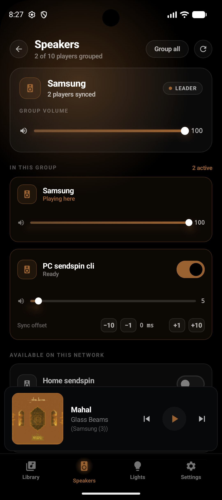
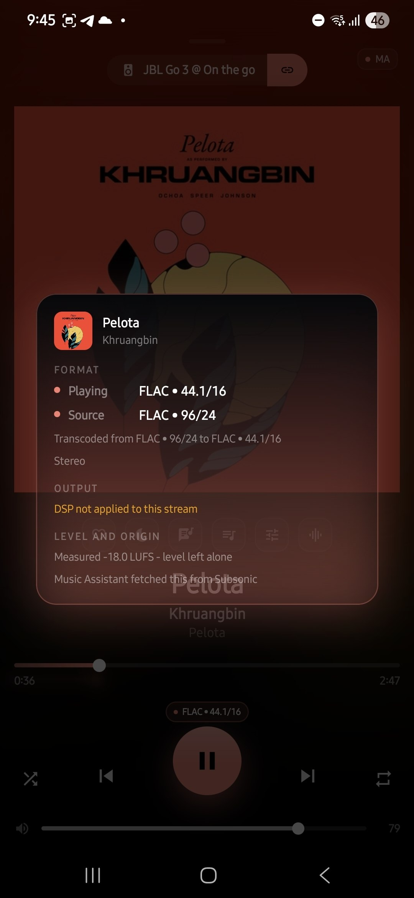
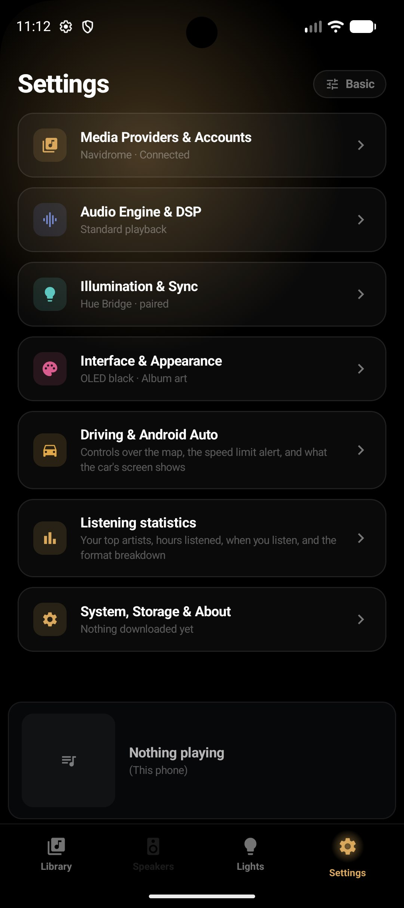

<p align="center">
  
</p>

<h1 align="center">CAMusic</h1>

<p align="center"><strong>One app. Your music. Your Phillips hue lights. Your music assistant speakers.</strong></p>

<p align="center">
  Play your library, sync your hue lights, group your music assistant speakers, and control it all from one place <br>
  all local and in one place.
</p>

<p align="center">
  <a href="https://github.com/engabd11/CAMusic/releases"></a>
  <a href="LICENSE"></a>
  
  
</p>

---

## Why CAMusic?

Most music apps make you choose. Want to play your own collection? That's one app. Stream to
speakers around the house? Another one. Sync your lights to the music? A third, probably with a
subscription. Group speakers? Yet another, if it's even available. This app evolved from the idea behind syncoV2, but having music playing in one place and lights sync in another is definitely annoying at times. If you prefer a dashboard card on Home Assistant have the option to do so, with syncoV2 only.

**CAMusic puts it all in one app** — a music player, a multi-speaker controller, and a light-sync
engine, with no feature locked behind a paywall:

| Feature | CAMusic | Typical player | Light-sync app |
|---|:---:|:---:|:---:|
| Play your own music library | ✅ | ✅ | ❌ |
| Multiple library servers | ✅ | ✅ (some) | ❌ |
| Group speakers | ✅ | ❌ | ❌ |
| Philips Hue Entertainment sync | ✅ | ❌ | ✅ (paid) |
| Offline playback | ✅ | ✅ (some) | ❌ |
| Parametric EQ per speaker | ✅ | ❌ | ❌ |
| 24-bit / hi-res output | ✅ | ❌ | ❌ |
| One app, no subscription | ✅ | — | — |

---

<p align="center">
  
  
  
  
  
  
</p>

## What it does

### Your music, your servers

Add as many libraries as you like — Navidrome, Jellyfin, any Subsonic-compatible server, or files
already on your phone — and switch between them freely. Each server is a card with its own
credentials, status and stream quality; one tap sets it active.

| Server | Auth | What it brings |
|---|---|---|
| **Navidrome** | Username + password | The reference — OpenSubsonic extensions give synced lyrics, ReplayGain, and exact per-track format metadata |
| **Subsonic / OpenSubsonic** | Username + password | Gonic, Airsonic, Astista, Ampache's Subsonic API — anything speaking the protocol |
| **Jellyfin** | Username + password | Original file streaming with per-track codec, bitrate, depth and channels |
| **This device** | Runtime permission | Music already on the phone or SD card — works entirely offline |
| **Music Assistant** | mDNS or URL | Not just a library — a full player ecosystem (see below) |

Capabilities are probed, not assumed. A plain Subsonic server is never offered a lyrics pane it
can't fill; the app asks what the server supports and lights up only what it declared.

### Music Assistant — play anywhere

When a Music Assistant server is in the picture, CAMusic becomes more than a player:

- **Browse the full library** — recently played, recently added, continue listening, for you, and
  favourites shelves, plus search-as-you-type with debounced results.
- **Play to any MA speaker** — the phone, a grouped set, or any other player on the network.
  Now Playing reflects and controls whichever speaker you select.
- **Queue management** — view, jump, reorder, remove, clear, save as playlist, or transfer the
  queue and playhead to another speaker mid-track.
- **Album and artist screens** — about section, related albums, top tracks, similar artists.
- **Version picker** — every copy of a track across every provider. The 16/44 stream, the 24/96
  purchase and the CD rip are a choice, not whatever the row came from.
- **Cross-device resume** — start on the phone, finish at the desk, same second of the same track.
- **Per-player parametric EQ** — bands with frequency, Q, gain and filter type, tone controls,
  preamp and presets, driven through MA's own DSP pipeline.
- **Server-side gapless and crossfade** — the app reads MA's config entries and renders whatever
  it finds, so a new MA build needs no update here.
- **Speaker grouping** around a leader, with per-player and group volume.
- **Home Assistant TTS announcements** arrive like any other MA player.

### As a Sendspin player on Music Assistant

CAMusic registers with Music Assistant over the Sendspin WebSocket protocol and stays available in
the background through a foreground service, so playback and announcements start without opening
the app. It stays in the background even when the app is closed for instant and reliable TTS, unless the battery saving setting in the app is enabled.

The clock-sync engine uses an NTP-style four-point exchange feeding a two-dimensional Kalman filter
that tracks offset *and* drift — grouped playback stays in step. The player reports `state: "error"`
and mutes until the filter converges, rather than joining a group with an offset still seconds wide.

FLAC, Opus and PCM are decoded through `MediaCodec` and played through `AudioTrack`. 24-bit is
opt-in: with bit-perfect on, the FLAC decoder is asked for float output and the track is built from
what the decoder actually reports, not from the depth the server claimed — because two-byte samples
in a three-byte frame is noise, not degradation.

Per-player sync offset is applied to frame scheduling locally and also written back to MA's config.

### Philips Hue Entertainment Sync - Direct or through home asssitant

CAMusic drives Philips Hue lights in time with the music using the Hue Entertainment API
(DTLS 1.2, 60 Hz). Two transports, picked in **Settings → Light Sync**
it follows the library backend automatically unless you pin it by hand. A **Quick Settings tile**
toggles the direct path from the notification shade.

#### Direct to the Hue Bridge

No Home Assistant, no integration, nothing between the music and the room. CAMusic connects
directly to a Philips Hue Bridge — discover a bridge over mDNS (with cloud discovery and manual
IP as fallbacks), press its link button to pair, choose an entertainment area, and the Lights
tab becomes a direct control surface.

Underneath: the decoded PCM is tapped out of the player's own render chain, run through an FFT with
SuperFlux onset detection and a mel filterbank, and turned into per-light colour by a Kotlin port of
[syncoV2](https://github.com/engabd11/syncoV2)'s effects engine. That goes to the bridge over
DTLS 1.2 on a pre-shared key, at 60 Hz — exactly what the Entertainment API expects.

What the port carries:

- Five intensity rungs (Subtle → Extreme) plus **Auto** — reads the music and moves between them
- A tempo PLL and structure tracker driving the show off the beat grid
- 3D room geometry and spatial waves
- The Fireworks effect
- Per-lamp attack and spectral pop
- **Stereo pan** — a hit lands on the side of the room it came from
- Vocal shimmer
- An eye-safety limiter
- A timing delay queue so the lights land with the audio
- Album-art and song colour extracted the way syncoV2 does it — by how much of the cover each
  colour occupies, not by what would look good as a UI accent
- Pre-scanned tracks — the show knows the song's shape from the first bar

> **Scope:** the tap sits in the ExoPlayer chain, so direct mode drives the show from this phone's
> *local playback* — Navidrome, Jellyfin, downloads, and local files. Music on a remote MA speaker
> uses the Home Assistant path.

#### Through Home Assistant (Philips Hue via syncoV2)

The original path. Drives the
[syncoV2](https://github.com/engabd11/syncoV2) `hue_music_sync` integration over the HA WebSocket
API, which controls Philips Hue lights through the Entertainment API: per-zone enable, intensity ladder, effect, brightness ceiling, timing offset, live tunables,
and all 19 colour schemes previewed with their real gradient colours. It follows an HA
`media_player` entity, which is what lets it reach speakers this phone is not playing through.

### Offline Playback and Library — download and go

Download a track, album or playlist for offline use — audio and cover art — with a storage cap and
a Wi-Fi-only option. A dedicated **Downloads screen** searches, sorts, retries failures, shows the
format each file actually is, and breaks storage down by album so the thing worth deleting is
findable. The storage cap never evicts the track you're listening to.

With the server unreachable the library drops to **Offline** and runs on what's on the phone. Stars
and play counts write back to the library the track came from when you're back online.

### Audiophile-grade playback

| Feature | Music Assistant path | Standalone path |
|---|:---:|:---:|
| Hi-res (88.2 / 96 kHz) | ✅ | ✅ |
| 24-bit float output | ✅ (bit-perfect mode) | ✅ (bit-perfect mode) |
| Gapless | ✅ (server-side) | ✅ (ExoPlayer) |
| ReplayGain | ✅ (MA normalisation) | ✅ (track / album) |
| Original file format | ✅ (format=raw) | ✅ (original stream) |
| Continuous play / radio | ✅ (server-side) | ✅ (on-device) |
| Smooth transitions | — | ✅ (1–12 s, auto-suppressed for albums) |
| EQ | ✅ (server DSP) | Planned |

### Playback details

- **Lyrics** — LRC-timed where the provider has them. The sung line sits centred, scrolls smoothly,
  scales into place, with a 200 ms lead and a trim in Settings for a server whose timings are off.
- **Quality badge** — `FLAC • 96/24 • 3 Mb/s`, channels, file size, and what Music Assistant did to
  the level. Normalisation is reported, not guessed at.
- **Similar** — acoustically similar tracks, or a natural-language search over sonic embeddings
  ("late night drive, warm synths").
- **Playlists** — create, delete, and add tracks on both backends.
- **Favourites, preview, playback speed, sleep timer.**

---

## Requirements

- **Android 12+** (API 31)
- **Music Assistant** 2.9+ (optional — for the MA player, speaker control, and HA Light Sync path)
- A self-hosted music library — **Navidrome**, any Subsonic/OpenSubsonic server, or **Jellyfin**
  (optional — the app works with local files alone)
- **Philips Hue Bridge** with an entertainment area (optional — for Hue Entertainment light sync)
- **Home Assistant** + syncoV2 (optional — for Hue light sync through HA)

Everything is optional except Android 12+. Start with one server or just local files and add more
as you go.

## Setup

1. Install the APK from [Releases](https://github.com/engabd11/CAMusic/releases).
2. The **onboarding wizard** asks where your music lives: Music Assistant, Navidrome, Jellyfin,
   or local files on the device. Credentials are encrypted at rest with the Android Keystore.
3. Optional steps in the same wizard: set up Philips Hue light sync (direct to bridge and/or through Home Assistant)
   and register this phone as a Music Assistant player.
4. Everything can be changed later under **Settings → Libraries**, **Settings → Light Sync**, and
   **Settings → CAMusic player**.

---

## Architecture

```
Jetpack Compose UI  ·  Material 3  ·  OLED design system (true black, album accent)
  Now Playing · Library · Speakers · Lights · Settings
        |
   ViewModels (per screen; player + library VMs hoisted to the app root)
   state collected lifecycle-aware, so a backgrounded screen stops working
        |
        +-- Sendspin protocol --  SendspinClient · ClockSync · Kalman filter
        |   (this phone as an MA player)      -> SendspinAudioEngine -> AudioTrack
        |
        +-- MA main API --------  MaApiClient (/ws) · MaRepository
        |   (browse, search, transport, queues, grouping, DSP, player config)
        |
        +-- OpenSubsonic -------  SubsonicClient · LocalPlayer (ExoPlayer)
        |                         LocalRadio · DownloadManager
        |
        +-- Jellyfin -----------  JellyfinClient · JellyfinSource
        |
        +-- Hue Bridge ---------  HueBridgeClient · HueDtlsClient · SyncoEngine
        |   (Philips Hue Entertainment      AudioAnalysisTap · TrackScanner · AlbumColours
        |    direct to bridge)
        |
        +-- Home Assistant -----  HaClient · LightSyncRepository
            (Philips Hue via syncoV2)

  SendspinConnectionService (foreground) keeps the process and socket alive
  SendspinService / LocalPlaybackService own the media notifications
```

One detail worth knowing: control JSON and binary audio share a single WebSocket, and
`stream/clear` only means something if it is still ordered against the audio around it. Everything
the socket produces therefore goes through **one** queue drained by one consumer, rather than
separate flows.

Colour comes from the artwork, twice, for two different jobs. The UI clusters covers in CIELAB
and ranks by vividness against size, because an accent has to stay legible on black. Light Sync
clusters the same cover and ranks purely by how much of it each colour occupies, because there the
weights are dwell time in a room. Sharing one extraction between them was a bug, not a saving.

### Audio pipeline

```
Music Assistant path                     Navidrome / offline path
--------------------                     ------------------------
WebSocket binary frame                   HTTP (format=raw) or local file
  [type=4][server_ts_us][payload]                    |
        |                                       ExoPlayer
  FLAC / Opus -> MediaCodec -+                  (gapless, exact seek, ReplayGain,
  PCM         -> passthrough-+-> AudioTrack      radio, smooth transitions,
        |                                        24-bit float output)
  scheduled against the                              |
  Kalman-filtered server clock                  AudioAnalysisTap -> Philips Hue
```

Formats are advertised, not requested: MA may only send something the client listed, so the list
*is* the setting. 48 and 44.1 kHz are always offered; 88.2/96 kHz with hi-res on; 176.4/192 kHz
only with bit-perfect on **and** only after probing that the device will open a track at that rate.

A native AAudio `I24` exclusive-mode pipeline lives in `app/src/main/cpp/`. It is not compiled and
nothing calls it — true bit-perfect output that bypasses the Android mixer is a future phase, not a
current feature.

---

## Roadmap

> CAMusic started as a Music Assistant Sendspin client. The idea has grown: **one app that
> replaces the two or three you're using right now** — a player, a speaker controller, and a
> light-sync engine, all local, all free. Here's where it's heading.

### ✅ Shipped

- [x] Music Assistant Sendspin player (FLAC, Opus, PCM)
- [x] Clock-synced grouped playback (Kalman filter, NTP-style four-point exchange)
- [x] MA library browser, search, queue, speaker control, playlists
- [x] Navidrome, Subsonic/OpenSubsonic, and Jellyfin as standalone libraries
- [x] Local files on device (MediaStore source)
- [x] Multiple library servers — add, switch, manage independently
- [x] Offline downloads with storage cap and Wi-Fi-only option
- [x] Room-backed download index (migrated from legacy JSON on first boot)
- [x] Continuous play / radio on the standalone path (on-device, with fallback ladder)
- [x] Smooth transitions on the standalone path (1–12 s, auto-suppressed for albums)
- [x] 24-bit output on both paths (bit-perfect mode)
- [x] ReplayGain on the standalone path (track / album, boost capped at +3 dB)
- [x] Direct Philips Hue Bridge light sync (no HA needed — DTLS 1.2, 60 Hz)
- [x] Home Assistant light sync via syncoV2 (Philips Hue Entertainment API)
- [x] Auto intensity, tempo tracking, stereo pan, vocal shimmer, Fireworks effect
- [x] Track pre-scanning (the show knows the song's shape from the first bar)
- [x] Album-art colour extraction (occupancy-weighted, not UI-accent guessing)
- [x] Per-player parametric EQ through MA's server-side DSP
- [x] Speaker grouping with per-player and group volume
- [x] LRC-timed lyrics with smooth scroll and timing offset
- [x] Quality badge and detail card (`FLAC • 96/24 • 3 Mb/s`)
- [x] Version picker — every copy of a track across every provider
- [x] Cross-device resume
- [x] Onboarding wizard (first-launch: pick server, optional Light Sync, optional MA player)
- [x] Adaptive grid layout for tablets and foldables

### Next up

- [ ] **True overlapping crossfade** on the standalone path — a second ExoPlayer ping-ponged with
      volume ramps, moving queue ownership and touching ReplayGain, the notification, and the
      analysis tap. The shipped smooth transitions are the first half; this is the second.
- [ ] **Warm reconnect** — `client/goodbye` with `reason: "restart"` on backgrounding, so MA holds
      the player slot for ~30 seconds and a quick app switch doesn't drop the phone from the
      speaker list.
- [ ] **Direct Philips Hue light sync from MA playback** — a second tap on `SendspinAudioEngine` so direct
      mode can replace the HA path outright rather than sit beside it.
- [ ] **Android Auto** — media3-session is already a dependency and the `MediaSession` exists;
      the work is a manifest declaration and a browse tree.
- [ ] **Glance home-screen widget** — now-playing at a glance.

### Planned

- [ ] **More library providers** — each is an adapter against the `MusicSource` interface, not a
      change to the app:
  - Emby (near-identical API to Jellyfin)
  - Plex (plex.tv PIN flow — no server password ever typed in the app)
  - Audiobookshelf (music libraries alongside audiobooks)
  - Kodi (JSON-RPC library browser)
- [ ] **Network filesystems** — SMB, WebDAV, Google Drive, OneDrive, Dropbox, Box, pCloud. These
      need a crawler, a tag reader and a local index. `MediaStore` proves the shared shape;
      `IndexedFileSource` is the interface they'll plug into.
- [ ] **Bit-perfect exclusive-mode output** — the native AAudio I24 path is written and
      deliberately not compiled. `flac_decode()` is still a skeleton and the ring buffer is
      byte-level rather than frame-level. The largest single audio item on the roadmap.
- [ ] **Release keystore and CI signing** — current releases use the local debug key (stable since
      v0.1.0, so updates work). A proper release key and CI-signed builds are the goal.
- [ ] **Instrumented tests** — 463 unit tests cover protocol, clock, DSP, parsing, the server list,
      and the Philips Hue Entertainment sync engine; nothing covers the audio path, the service lifecycle, or the UI.
- [ ] **Crash reporting** — self-hosted ACRA or similar.

---

## Known limitations

Written down because the alternative is discovering them by ear:

- **Direct Philips Hue light sync cannot see MA playback.** It taps this phone's local player chain, so it
  follows the Navidrome, Jellyfin, downloads, and local-files paths. MA streaming uses the
  Home Assistant path.
- **Cleartext is allowed to LAN addresses only.** A server reached over plain HTTP on a public
  hostname is refused rather than sent credentials in the clear — use HTTPS for anything off
  the local network.
- **Jellyfin is still experimental and you may have issues in playback until version 0.9.0

---

## Building

JDK 17 and the Android SDK (compileSdk 36). No NDK needed.

```bash
./gradlew assembleRelease        # app/build/outputs/apk/release/app-release.apk
./gradlew :app:testDebugUnitTest # 463 unit tests across 54 classes
./gradlew :app:lintDebug
```

Judge anything about how the app *feels* on a release build. A debug build carries Compose
composition tracing, skips R8, and runs `debuggable`, which suppresses most of ART's optimisation
— scroll performance measured on one is measuring the build, not the app.

```bash
./gradlew :app:installRelease -PsideBySide   # installs alongside, own empty data
./gradlew :app:generateBaselineProfile       # needs a device; WIPES app data
./gradlew :app:compileReleaseKotlin -PcomposeMetrics   # skippability reports
```

Releases are cut locally. See the header of
`.github/workflows/release.yml`.

## Documentation

- [Release notes](docs/release-notes/) — what changed in each release, and why
- [v0.8 plan](docs/v0.8-plan.md) — the current plan, a table of what shipped against it, and the
  remaining roadmap sequenced
- [Direct Hue plan](docs/direct-hue-plan.md) and
  [gap analysis](docs/direct-hue-bridge-gap-analysis.md) — the direct Light Sync port, and what
  it was measured against
- [v0.5.0 analysis](docs/v0.5.0-analysis.md) — the full codebase analysis the roadmap grew out of
- [Improvement roadmap](docs/improvement-roadmap.md) — the API audit, and a Corrections section
  recording where earlier notes were wrong
- [Providers](docs/providers.md) — the `MusicSource` adapter recipe, and the auth and endpoints
  every planned provider needs
- [Protocol alignment](docs/protocol-alignment.md) — what MA's Sendspin provider actually speaks
- [Architecture decision](docs/architecture-decision.md)
- [Design brief](docs/design-brief.md)
- [Track prescan](docs/track-prescan.md)

## Contributing

See [CONTRIBUTING.md](CONTRIBUTING.md). PRs against `master`, conventional commits, Android Studio
for builds. The project uses Kotlin + Jetpack Compose + media3 + ExoPlayer.

## Credits

The Sendspin client and audio engine are modelled on MA and Navidrome APIs. The Philips Hue
Entertainment sync effects engine is a port of [syncoV2](https://github.com/engabd11/syncoV2).
Fully compatible with the Philips Hue Entertainment API and specs.

Built by **Cyborg Automation AU** — [cyborgautomation.com.au](https://cyborgautomation.com.au)

## License

MIT — see [LICENSE](LICENSE).
