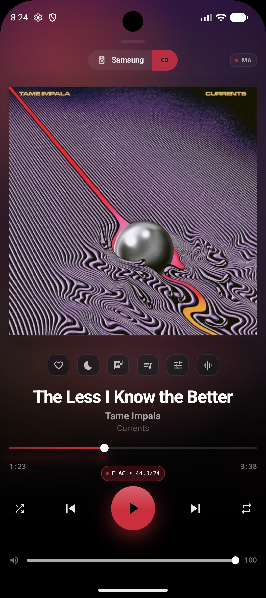
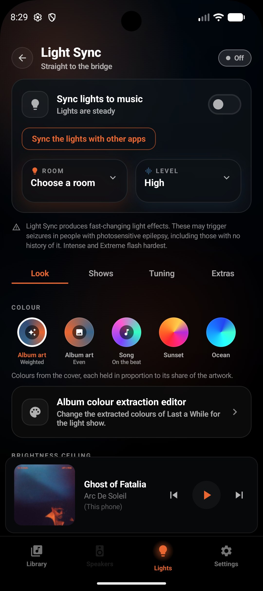
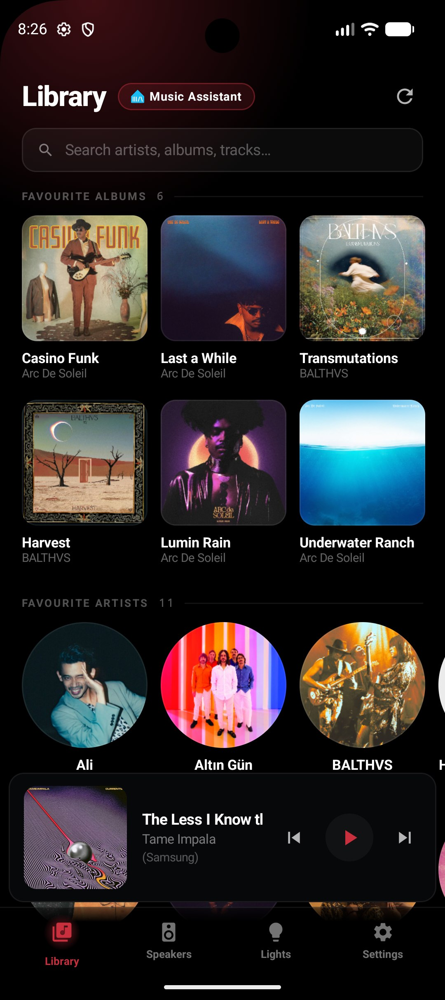

<p align="center">
  
</p>

<h1 align="center">CAMusic</h1>

<p align="center"><strong>Your library, your speakers, your lights, in one local app.</strong></p>

<p align="center">
  A music player for the servers you already run, with a Philips Hue light show,<br>
  ambience effects and multi-room audio built in. Everything happens on your own network.
</p>

<p align="center">
  <a href="https://github.com/engabd11/CAMusic/releases"></a>
  <a href="LICENSE"></a>
  
  
</p>

---

## Overview

CAMusic plays the music you own, from whichever server you run, and turns the room around
it into part of the listening.

| | |
|---|---|
| 🎵 **A player** | Navidrome, Subsonic, Jellyfin, Emby, Plex, Music Assistant and on-device files. Gapless playback, a ten band equaliser, high resolution output, ReplayGain and offline downloads. |
| 💡 **A light show** | Philips Hue Entertainment, driven straight to the bridge at 60 frames a second from the audio that is playing. |
| ✨ **An atmosphere** | Ambience shows with their own sound, ready whenever you want the room without the music. |
| 🔊 **A speaker** | Music Assistant can stream to this phone as a clock synced player, so it joins a grouped, multi-room setup. |

Runs on phones and tablets, Android TV, Android Auto and LG webOS televisions.

<p align="center">
  
  
  
</p>

---

## Why CAMusic

CAMusic is short for Cyborg Automation Music, built by
[Cyborg Automation AU](https://github.com/engabd11).

The idea started with Philips Hue. Spotify and Samsung's Music Sync can drive the Hue
Entertainment system properly, and if you listen anywhere else most players fall back to a
generic colour cycle that leaves the rest of what the bridge can do on the table. CAMusic
renders straight to the bridge at 60 frames a second instead, reading the room's own layout
and the track itself to shape every effect, so a Hue Entertainment setup gets the quality it
is actually capable of whatever you are playing from.

The player grew from there into the whole point: one app that browses every library you own,
sounds right on good hardware, and lights the room while it plays.

---

## Your libraries

Point CAMusic at a server you already run. Every backend is a first class citizen, and you
can add as many as you like and switch between them freely.

| Server | Browse | Play | Download | Scrobble |
|---|:---:|:---:|:---:|:---:|
| **Navidrome / Subsonic** | ✅ | ✅ | ✅ | ✅ |
| **Jellyfin** | ✅ | ✅ | ✅ | ✅ |
| **Emby** | ✅ | ✅ | ✅ | ✅ |
| **Plex** | ✅ | ✅ | ✅ | ✅ |
| **Music Assistant** | ✅ | ✅ | n/a | ✅ |
| **On-device files** | ✅ | ✅ | n/a | n/a |

Artists, albums, playlists, radio, podcasts and audiobooks, with search across all of them.
Multi-disc albums group properly, liner notes and biographies appear where the server has
them, and each server shows its own brand mark everywhere it is listed.

Plex signs in through a plex.tv PIN: tap **Sign in with Plex**, finish it in the browser, and
your Plex password stays at plex.tv where it belongs.

**Continue listening** leads the library with the albums and songs you were last in the
middle of, including Jellyfin's own resume shelf. Anything can be taken offline for the train,
with a storage cap and a Wi-Fi only option, and downloads browse as a library of their own.

---

## Sound

Playback is built to be worth good headphones and a good DAC.

- **A ten band equaliser** for everything this phone plays, built on RBJ biquads in a
  zero latency cascade, with automatic headroom so a boosted band stays clean on loud
  masters. Music Assistant's own parametric DSP is exposed separately for the rooms it runs.
- **The real signal path**, reported a stage at a time: what the file declares, what the
  decoder handed over, what the sink was configured with, and whether the high resolution
  float path is engaged. Where resolution is being lost, the card says so in a sentence.
- **High resolution output**, ReplayGain (track or album), and a quality badge that reads
  `FLAC • 96/24 • 3 Mb/s` with a detail card behind it.
- **Gapless playback**, smooth transitions from one to twelve seconds, and beat matched
  crossfades that align to the beat grid of both tracks when scan data is available.
- **USB DAC awareness**: connect one and CAMusic tells you what it can do and offers to pin
  the output to it.
- **Keep the music going** with continuous radio on every path, plus favourites, a version
  picker that lists every copy of a track across every provider, and cross-device resume.

---

## Light Sync

Two paths, chosen in Settings.

### Straight to the bridge

The one to use. CAMusic opens its own DTLS entertainment stream to the Hue bridge and renders
**60 frames a second** from the audio it is decoding.

- **Real spatial awareness.** Lamp positions come from the entertainment area, so waves travel
  across the room, bass sits low, and the room's own shape (a line, a ring, a cluster) changes
  how effects are drawn.
- **Colour from the album art**, extracted for a *room* rather than for a UI accent, and
  weighted so each colour holds for its share of the sleeve.
- **Five intensity rungs** plus Auto, which picks per track.
- **Saved shows.** A dinner is not a party is not a film score. Each show stores intensity,
  palette, brightness and every feature toggle as one preset. Tap a chip to apply it, and tie a
  show to a genre so the room picks it up on its own.
- **Creative layers**: Music DNA, Emotional Arc, Phantom Stage with on-device stem separation,
  and Phone as Conductor. See [docs/creative-light-shows.md](docs/creative-light-shows.md).
- **Flash safety** on a WCAG derived budget, with a 12.5 Hz per channel ceiling that matches
  what the Zigbee relay can carry.
- **Lights from other apps** through MediaProjection capture, so a video or another player can
  drive the room too.

### Through Home Assistant

A syncoV2 bridge for anyone already running that setup, with a smaller effect set.

### When the phone is not making the sound

Playing to a speaker in another room means this phone has no audio to analyse. The show keeps
running from an **offline scan** of the track, with beats, sections and spectral shape worked
out in advance and followed against the server's playhead.

---

## Ambience Effects

Shows with their own sound, ready without any music playing: **fireworks, thunderstorm,
underwater, fireplace, light train and aurora**, each with a bundled recorded bed.

Where the sound has to land with the light, both come from one event rather than from two
things kept in step. A lightning strike is a single object: the room reads it as it happens,
and the speaker reads it after the propagation delay its own distance implies, so the thunder
lands with the flash at any intensity on any hardware. That audio is synthesised on the phone,
so it keeps evolving rather than looping. Any effect can take an audio file of your own as its
bed instead.

---

## Multi-room with Music Assistant

Music Assistant is one of the libraries above, and it adds one thing the others do not:
**speaker grouping across the house**.

**As a controller.** Group and ungroup speakers, set per-player sync offsets, drive the queue,
and reach MA's gapless, crossfade and DSP settings from here rather than from its web UI. The
library front page is built from MA's own Discover rows, so a row your providers grow appears
without an app update.

**As a speaker.** CAMusic registers itself as a Sendspin player, so MA can stream to this phone
like any other speaker, including inside a synced group.

- **FLAC, Opus and PCM**, decoded by `MediaCodec` and played through a native Oboe output engine
  with its own timeline.
- **Clock sync** by a two-state Kalman filter over an NTP-style four-point exchange, with drift
  correction in native code. The offset is persisted, so a reconnect starts warm.
- **Announcements** (Home Assistant TTS, doorbells, timers) reach the phone in the background
  and duck whatever is playing.
- **A signed latency trim** in Settings → Player, for when this phone's output path runs ahead
  of or behind the rest of the room.
- **Play at original quality** streams the untouched file straight from your library server when
  MA would otherwise have transcoded it for the phone.

---

## Build a set

CAMusic scans the tempo, key and per-section energy of your local tracks, and the **Set
Builder** puts that to work. Pick a shape (warm-up, peak, wind-down or arc) and a length, and it
orders the tracks in front of you into that curve, choosing keys and tempos that mix wherever
there is a choice between equals. **Harmonic DJ mode** does the same job continuously for the
auto-queue. Both state their scan coverage up front, so you always know what the ordering had
to work with.

---

## Your listening

A **recap poster** leads the stats screen: your listening over the window you pick, drawn as
one shareable picture and measured by a scanner running on your own phone, from records you own.
The key and the tempo on it are the same ones that drive the light show. Behind it sit the full
charts: a listening clock, a tempo and energy scatter, dominant keys and a BPM sweet spot, artist
variety, streaks, lossless share, and where your music actually came from.

---

## Everywhere you listen

- **Android Auto.** A full browse tree over every configured library server, with search and
  voice. A track tapped in the car always plays on *this phone*, never on a speaker in another
  room, and for a Music Assistant track it moves the speaker selection here too, so the car's
  transport buttons address the player it just started.
- **Android TV.** A dedicated `tv` flavour with a D-pad Now Playing, Library, Queue, Light Sync,
  onboarding and Settings, compiled from the same business logic as the phone app.
- **LG webOS.** A native webOS television app with a ten-foot UI, multi-library playback and a
  Node.js JS Service that streams Hue Entertainment over UDP straight from the TV. See
  [webos/README.md](webos/README.md).
- **Driving mode.** Large targets, swipe anywhere, and GPS speed-limit awareness from an offline
  geohashed database of 471,569 zones that ships inside the app. Picture-in-Picture is the
  permission-free default, with a full-width overlay behind it, triggered by the car's Bluetooth.
- **Home-screen widget** with artwork and transport controls.
- **Tablets and foldables** get an adaptive grid layout.

---

## Setup

1. Install the APK from [Releases](https://github.com/engabd11/CAMusic/releases).
2. Open it and follow the onboarding: point it at a server, and optionally pair a Hue bridge by
   pressing the button on the bridge when asked.
3. Start listening. A server address is the whole of it.

**Requirements:** Android 12 or newer. Any Subsonic, Jellyfin, Emby, Plex or Music Assistant
server for the library, a Hue bridge with an entertainment area for Light Sync, and a Music
Assistant server for multi-room grouping. Each one is optional and independent of the others.

Settings, servers and credentials can be exported as a password-encrypted file and imported on
another device, where the credentials are re-encrypted under that device's Keystore.

### On Android TV

Sideload the same APK. The TV flavour brings up its own D-pad navigable UI.

### On LG webOS

Package and install with the webOS CLI. The steps are in [webos/README.md](webos/README.md).

---

## Architecture

```
                         ┌──────────────────────────────┐
                         │        UI (Compose)          │
                         │  Library · Now Playing ·     │
                         │  Lights · Effects · Speakers │
                         └───────────────┬──────────────┘
                                         │
                    ┌────────────────────┼────────────────────┐
                    │                    │                    │
            ┌───────▼────────┐   ┌───────▼────────┐   ┌───────▼────────┐
            │  PlaybackOwner │   │ UnifiedNowPlay │   │ DirectLightSync│
            │ who owns sound │   │  one truth for │   │  60 Hz render  │
            └───────┬────────┘   │   the screen   │   │      loop      │
                    │            └───────┬────────┘   └───────┬────────┘
        ┌───────────┴───────────┐        │                    │
        │                       │        │            ┌───────┴────────┐
┌───────▼───────┐      ┌────────▼──────┐ │            │  Hue bridge    │
│  LocalPlayer  │      │   Playback    │ │            │  DTLS · 2100   │
│  (ExoPlayer)  │      │  (Sendspin)   │ │            └────────────────┘
│  Navidrome ·  │      │  MA streams   │ │
│  Jellyfin ·   │      │  to us        │ │
│  Emby · Plex ·│      └────────┬──────┘ │
│  local files  │               │        │
└───────┬───────┘               │        │
        │                       │        │
        │              ┌────────▼──────────────┐
        │              │ SendspinNativeEngine  │
        │              │ MediaCodec → Oboe     │
        │              │ clock-synced timeline │
        │              └────────┬──────────────┘
        │                       │
        └───────────┬───────────┘
                    │
            ┌───────▼────────┐
            │AudioAnalysisTap│  FFT, beats, key, structure
            └────────────────┘  → feeds the light engine
```

Position on every path comes from `PlayerPositionTracker`. On Music Assistant it is anchored on
the server's own `elapsed_time` rather than on a local counter, so the progress bar agrees with
the server.

### Audio pipeline

```
Music Assistant ──ws──► SendspinClient ──► SendspinTimeline (decode thread)
                             │                     │
                       ClockSync                MediaCodec
                    (Kalman filter)                │
                             │                     ▼
                             └──────────► SendspinNativeOutput
                                          (Oboe · drift correction)
                                                   │
                                                   ├──► speaker
                                                   └──► AudioAnalysisTap ──► Light Sync

Library servers ──► ExoPlayer ──► LocalDsp ──► TapRenderersFactory ──► AudioTrack
and local files                                        │
                                                       └──► AudioAnalysisTap ──► Light Sync
```

Both paths feed the same analysis tap, which is what lets one light engine serve whichever is
playing. `LocalDsp` sits ahead of the tap so the show reacts to what you actually hear.

---

## Recent releases

**v0.11.0**: Emby and Plex as libraries; recorded sound for the ambience effects; a spectrum
analyser that reads as one; lyrics as typography; Settings reorganised.
**v0.10.9**: native Oboe Sendspin engine; the MA playhead rewritten on the server's anchor;
the webOS TV app; GPS speed limits; Effects mode.
**v0.10.8**: six creative features behind their own settings; on-device stem separation.
**v0.10.7**: Android Auto; the first Android TV release; phone UI polish.
**v0.10.6**: analyser v3, taking key detection from 12.4 % to 71.1 % shift consistency.

Landed since v0.11.0: the ten band equaliser, the signal path card, saved light shows with
genre rules, the Set Builder, the shareable listening recap, and the offline speed-limit
database shipping inside the app.

Full history: [docs/release-history.md](docs/release-history.md).

### Next up

- Wear OS companion
- Audiobookshelf and Kodi as libraries
- Network filesystems: SMB, WebDAV and the major cloud drives
- True overlapping crossfade on the standalone path
- Bit-perfect exclusive-mode output through the native AAudio path
- More effects, and more bundled beds

---

## Good to know

- **A Hue entertainment area serves one client at a time.** If the Hue app takes the area,
  CAMusic's stream is handed over and stays stopped, deliberately, so its own stop button keeps
  working.
- **Music DNA reads a local track scan**, so it waits while Music Assistant is streaming to the
  phone. The toggle says as much.
- **Per-speaker offsets are positive on the Music Assistant side**, whose config field is
  unsigned. For a phone that needs to move the other way, use the app's own signed latency trim.
- **Releases are signed with a stable local key** that has been in use since v0.1.0, so updates
  install cleanly over each other. A build from another source needs an uninstall first.
- **The speed-limit database adds about 39 MB to the APK**, which is the cost of offline
  speed-limit awareness and is stated here so it is never a surprise.

---

## Building

```bash
git clone https://github.com/engabd11/CAMusic.git
cd CAMusic
./gradlew assembleMobileDebug          # phone and tablet
./gradlew assembleTvDebug              # Android TV
./gradlew testMobileDebugUnitTest      # ~1,000 unit tests
```

Requires JDK 17 or newer and the Android SDK. The native audio engine builds through CMake as
part of the normal Gradle build, so there is nothing extra to install. The speed-zone database
is stored in git-lfs, so run `git lfs pull` after cloning.

Flavours are `mobile` (the default, and the one every release ships as) and `tv`, so Gradle
tasks are flavour qualified. `-PsideBySide` adds a `.freshtest` application id suffix for
installing alongside a release build.

---

## Documentation

| Document | What it covers |
|---|---|
| [docs/protocol-alignment.md](docs/protocol-alignment.md) | The Sendspin protocol as Music Assistant actually speaks it |
| [docs/creative-light-shows.md](docs/creative-light-shows.md) | The four creative light-show layers |
| [docs/spatial-swell-implementation.md](docs/spatial-swell-implementation.md) | Room-aware spatial effects |
| [docs/ma-playhead-rewrite-plan.md](docs/ma-playhead-rewrite-plan.md) | Why the playhead is anchored on the server's clock |
| [docs/track-prescan.md](docs/track-prescan.md) | Offline scanning, for light sync on a remote speaker |
| [docs/providers.md](docs/providers.md) | Adding a music backend |
| [docs/architecture-decision.md](docs/architecture-decision.md) | Why direct to the bridge rather than through Home Assistant |
| [webos/README.md](webos/README.md) | The webOS TV app, its JS Service and its build |
| [docs/release-history.md](docs/release-history.md) | Every shipped feature, by release |

---

## Contributing

See [CONTRIBUTING.md](CONTRIBUTING.md). Bug reports with a logcat are welcome, and so is
anything that makes the light show look better in a real room.

## Credits

CAMusic is developed by Cyborg Automation AU. It builds on
[Music Assistant](https://music-assistant.io), the Sendspin protocol, and
[syncoV2](https://github.com/oliverhoefling/syncoV2), whose colour extraction and effect model
the direct light path is a port of. Clock sync follows MassDroid's approach.

## License

Apache License 2.0. See [LICENSE](LICENSE).
