

  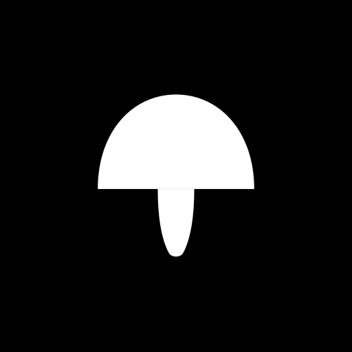

<h1 align="center">CAMusic</h1>

<strong>Hue light shows for the music you host yourself.</strong>

  A free, open source Android music player made for Sendspin players on Music Assistant. 
  It also plays straight from Navidrome, Jellyfin, Plex, Emby, MPD and more, with the same light show.

  
  
  
  

---

## What CAMusic is for

CAMusic is made for **Sendspin players on Music Assistant**. Your phone joins the group as a clock-synced speaker, so music plays in step across the house, and your Philips Hue lights follow along. It also stands on its own as a player for the servers you already run (Navidrome, Jellyfin, Plex, Emby, MPD and more), with the same light show, ambience effects and AirPlay output.

CAMusic is short for Cyborg Automation Music, built by [Cyborg Automation AU](https://cyborgautomation.com.au/pages/camusic) in Melbourne. It began as a hi-res Sendspin player and grew into one app that browses every library you own, sounds right on good hardware and lights the room while it plays. The light show renders straight to the Hue bridge at 60 frames a second, reading the room's layout and the track itself to shape every effect, so a Hue Entertainment setup gets the quality it is capable of whatever you play from.

  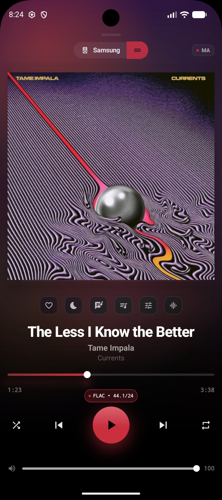
  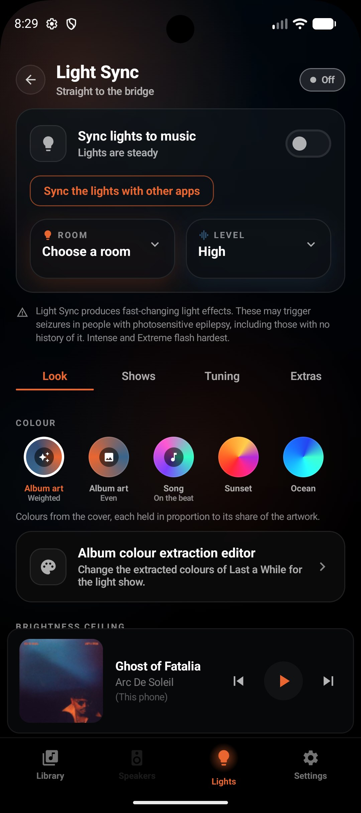
  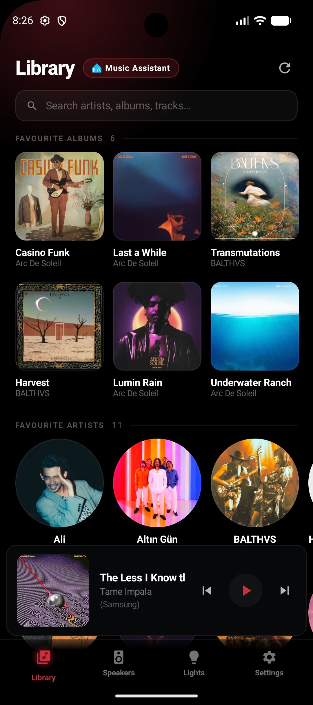

  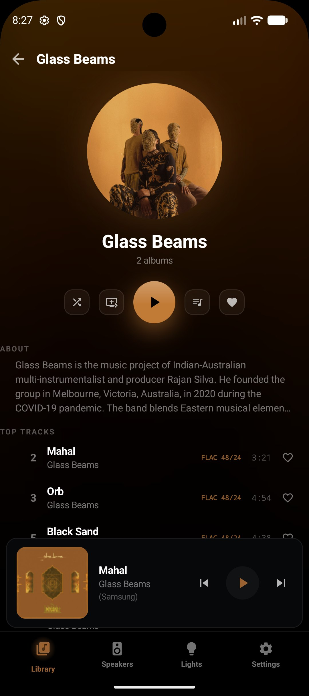
  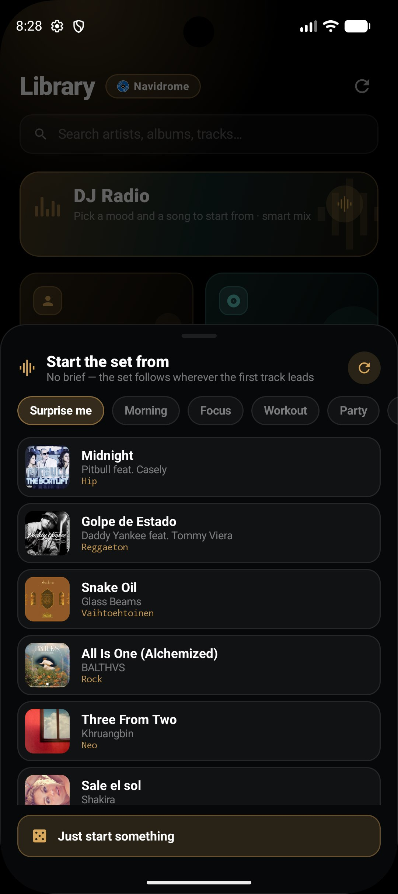
  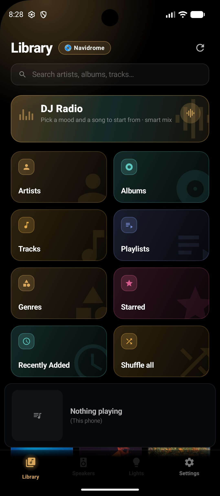
  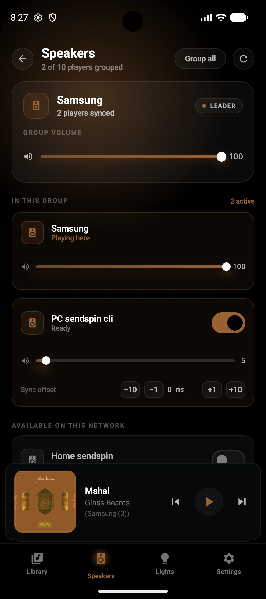
  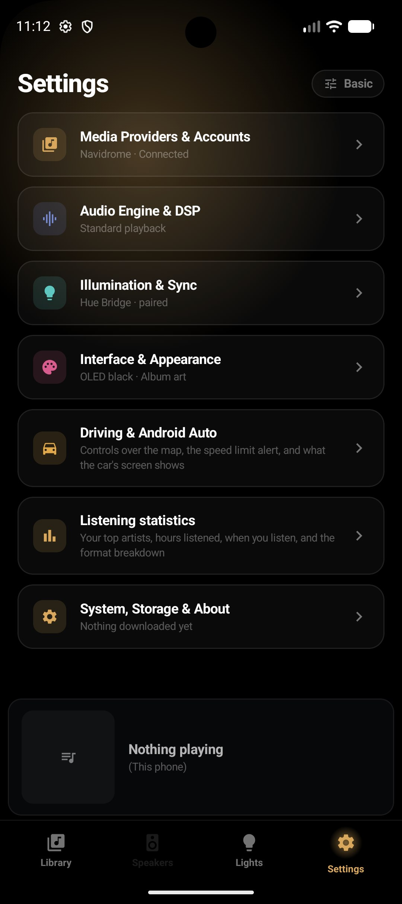

  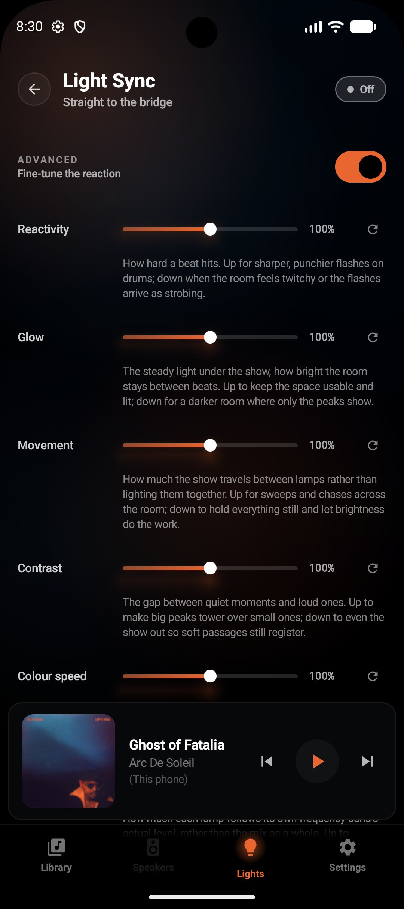
  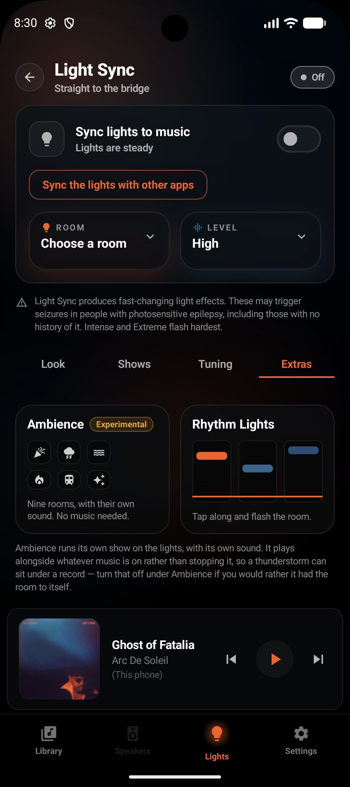
  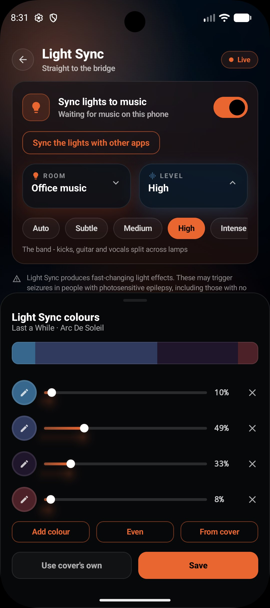
  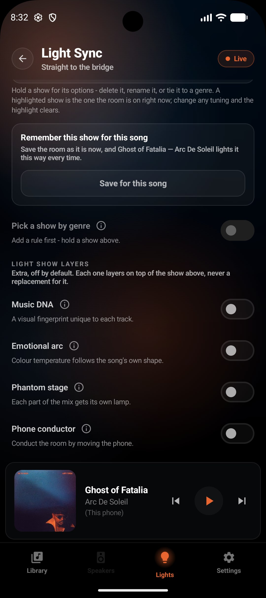

  <em>Android Auto and Android Automotive</em> 
  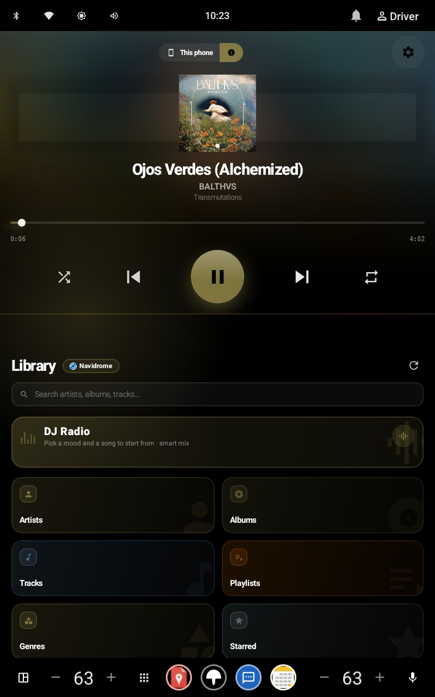
  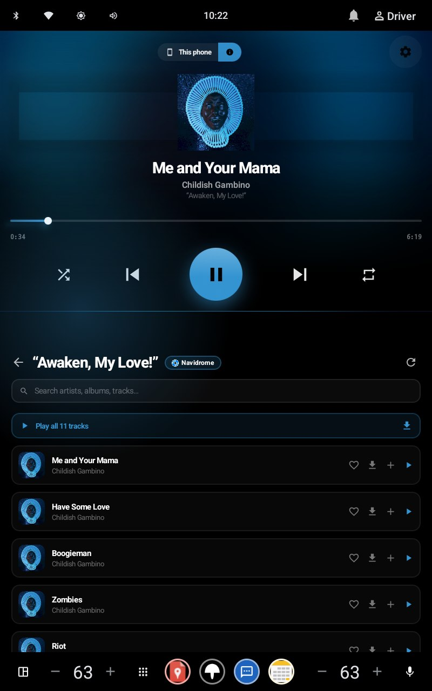
  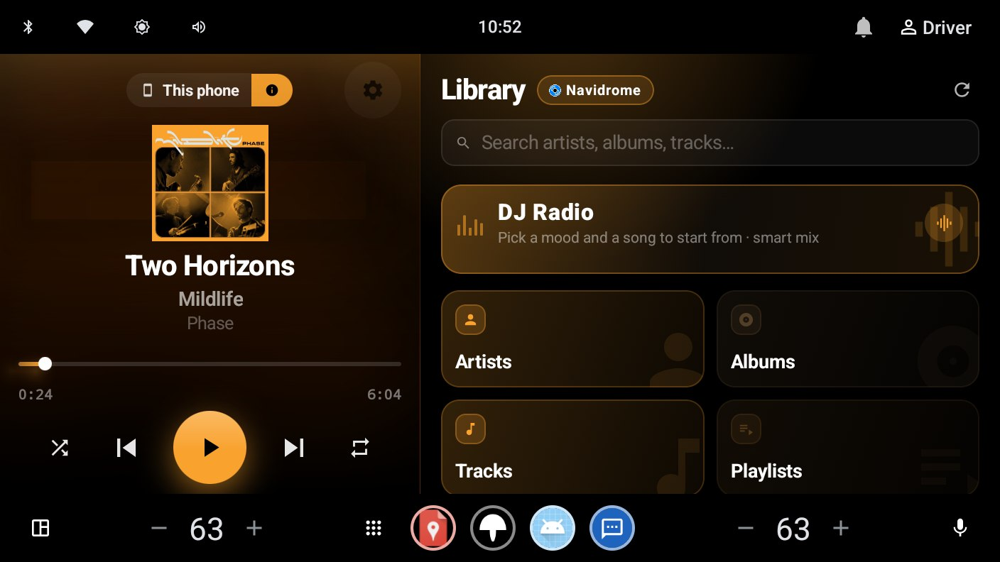

  <em>Android TV and tablet</em> 
  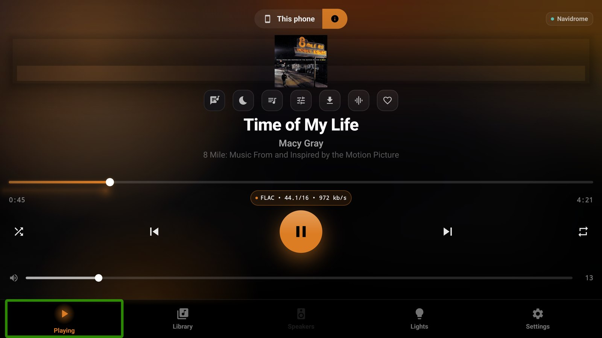
  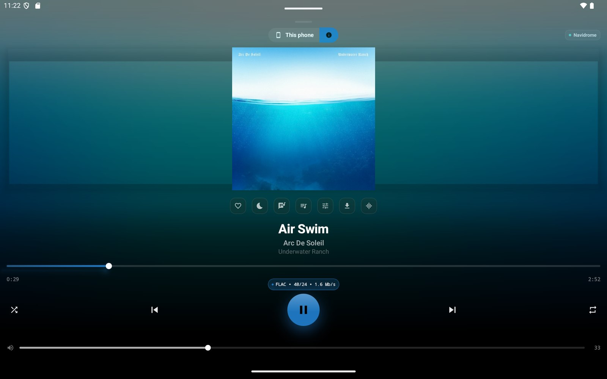

---

## What you get

- **Sendspin and multi-room.** CAMusic registers as a Sendspin player, so Music Assistant can stream to the phone like any other speaker, including inside a synced group. As a controller it groups speakers, sets per-player offsets and drives the queue. See [multi-room](docs/multi-room.md).
- **Your own libraries.** Navidrome and Subsonic-compatible servers (Gonic, Airsonic, Ampache, Funkwhale, LMS), Jellyfin, Emby, Plex, MPD (moOde, Volumio, piCorePlayer and Mopidy are MPD underneath), Music Assistant and files on the device. Spotify, Qobuz and Tidal accounts and foobar2000 over Beefweb are experimental. Add as many libraries as you like and switch between them freely. See [libraries](docs/libraries.md).
- **A Philips Hue light show.** Philips Hue Entertainment, driven straight to the bridge at 60 frames a second from the audio that is playing. Lamp positions come from your entertainment area, colours come from the album art, and shows can be saved, tied to a genre and shared. See [light sync](docs/light-sync.md).
- **Sound built for good hardware.** A ten band equaliser, gapless playback, a real crossfade on any queue, ReplayGain, high resolution output, USB bit-perfect (experimental), synced lyrics, scrobbling to ListenBrainz and Last.fm, and offline downloads. See [sound](docs/sound.md).
- **Ambience effects.** Fireworks, thunderstorm, underwater, fireplace, light train and aurora, each with its own recorded sound, ready for the times you want the room rather than the music.
- **AirPlay output.** Whatever the phone plays itself can go to an Apple TV, a HomePod or an AirPlay speaker from the top-left of Now Playing.
- **Everywhere you listen.** Phones and tablets, Android Auto, Android Automotive and Android TV, plus an LG webOS app where the TV panel itself becomes the light show. Driving mode adds large targets and GPS speed-limit awareness. See [platforms](docs/platforms.md).
- **Yours to keep.** Your library, history and sign-ins stay on your phone and your own servers. Online lyrics, scrobbling and streaming accounts connect only when you switch them on.

## Light Sync

Light Sync needs a Hue Bridge v2 with an entertainment area made in the Hue app. CAMusic opens its own DTLS entertainment stream to the bridge and renders **60 frames a second** from the audio it is decoding, with five intensity levels plus Auto, saved and shareable shows, and a tap-along game called Rhythm Lights. When the sound comes from a speaker in another room, the show follows an offline scan of the track. A [Hue Synco](https://github.com/engabd11/syncoV2) bridge in Home Assistant works too, with a smaller effect set.

Light Sync produces fast-changing light effects. These may trigger seizures in people with photosensitive epilepsy, including those with no history of it. Intense and Extreme flash hardest. Details are in [light sync](docs/light-sync.md#photosensitivity).

## Get started

1. Install the APK from [Releases](https://github.com/engabd11/CAMusic/releases).
2. Open it and follow the onboarding: pick a server or a streaming account, sign in, and optionally pair a Hue bridge by pressing the button on the bridge when asked.
3. Start listening. A server address is the whole of it.

**Requirements:** Android 12 or newer. Everything else is optional and independent of the rest: a Subsonic, Jellyfin, Emby, Plex, MPD, foobar2000 (with Beefweb) or Music Assistant server for the library, or a Spotify Premium, Qobuz or Tidal account; a Hue bridge with an entertainment area for Light Sync; a Music Assistant server for Sendspin multi-room grouping; and an AirPlay receiver for casting.

Android TV has its own `tv` build, made from source. LG webOS has a preview app. Both are covered in [getting started](docs/getting-started.md) and [platforms](docs/platforms.md).

## Next up

- Chromecast, the way AirPlay landed
- Artwork on an AirPlay receiver's own Now Playing
- Wear OS companion
- Audiobookshelf and Kodi as libraries
- Network filesystems: SMB, WebDAV and the major cloud drives
- A live-wired ambient background for the Android TV app, beyond today's fallback palette
- More effects, and more bundled beds

## Documentation

| Document | What it covers |
|---|---|
| [docs/getting-started.md](docs/getting-started.md) | Install, first run, requirements and encrypted backup |
| [docs/libraries.md](docs/libraries.md) | Every library, how each one behaves and what works across all of them |
| [docs/streaming-services.md](docs/streaming-services.md) | Spotify, Qobuz and Tidal accounts (experimental) |
| [docs/sound.md](docs/sound.md) | Equaliser, output modes, USB bit-perfect, ReplayGain, crossfade, DJ Radio and lyrics |
| [docs/light-sync.md](docs/light-sync.md) | The Hue light show, ambience effects and photosensitivity |
| [docs/multi-room.md](docs/multi-room.md) | Sendspin on Music Assistant, and AirPlay output |
| [docs/listening.md](docs/listening.md) | The Set Builder and listening stats |
| [docs/platforms.md](docs/platforms.md) | Android Auto, Android Automotive, Android TV, LG webOS and Driving mode |
| [docs/architecture.md](docs/architecture.md) | Playback, the light engine and the Hue bridge |
| [docs/good-to-know.md](docs/good-to-know.md) | Behaviour that is deliberate |
| [docs/building.md](docs/building.md) | Build from source |
| [docs/release-history.md](docs/release-history.md) | Every shipped feature, by release |
| [docs/README.md](docs/README.md) | The full index, including protocol notes, plans and audits |

## Part of the Cyborg Automation lighting projects

- **CAMusic** is an Android music player made for Sendspin players on Music Assistant, with Hue light shows.
- **[Hue Synco](https://github.com/engabd11/syncoV2)** is a Home Assistant integration that lights Hue to the music of any media player.
- **[Hue Ghost](https://github.com/engabd11/HueGhost)** lights films, games and apps from your PC.

Use one or all three. They can share an entertainment area by taking turns, because an area streams from one app at a time. See all three on the [open source lighting page](https://cyborgautomation.com.au/pages/oss-lighting).

## Contributing

See [CONTRIBUTING.md](CONTRIBUTING.md). Bug reports with a logcat are welcome, and so is anything that makes the light show look better in a real room.

## Credits

CAMusic got through its first month of development with the help of two projects that were already solving the same problems in the open: [Music Assistant](https://github.com/music-assistant/server) and [MassDroid](https://github.com/sfortis/massdroid_native) by Dionysis Fortis. Third-party material shipped in the app, and its licences, are listed in [docs/attributions.md](docs/attributions.md).

## Licence

Apache License 2.0. See [LICENSE](LICENSE).
